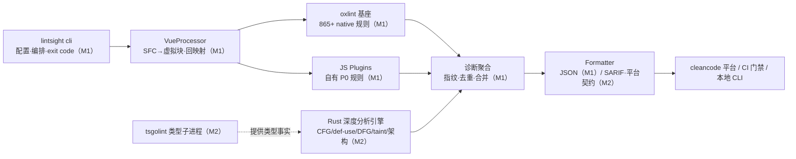

# lintsight

> 面向企业级大规模 JS/TS 代码库的静态分析引擎：**缺陷检测 + 安全扫描（taint 数据流）为主轴**，架构约束与代码度量为第二梯队，作为公司 SAST 平台（cleancode）的扫描内核。

**状态**：设计冻结，M0 准备期（尚无代码）｜文档版本：设计 v0.2 / 需求 v0.1

## 为什么是 lintsight

ESLint 生态在**数据流/污染追踪、跨文件架构约束、平台化闭环**上存在结构性空缺——这正是 lintsight 的差异化空间：

- **双引擎架构**：[oxlint](https://oxc.rs)（865+ 内置规则、50~100x ESLint 性能）承担语法级规则宿主；自建 Rust 深度分析引擎（基于 oxc crates 直连）补齐 CFG / def-use / DFG / taint，诊断在报告层合并。
- **taint 路径可解释**：source → sanitizer → sink 全路径事件流输出，直接对接 cleancode 平台「路径跟踪」面板逐节点定位（CodeQL 风格证据链），同时供 AI 研判消费。
- **规则双轨**：语法级规则用 JS/TS 编写（ESLint 兼容 API，可迁移），深度规则用 Rust 编写（直查引擎 IR）——前端团队不必全员学 Rust。
- **Vue 一等公民**：公司主栈 Vue，SFC 支持是 MVP 硬性 P0（script M1 / template M2）。
- **宁漏报不误报**：confidence 与 severity 解耦，CI 门禁只拦 `error + high`；误报率超标规则自动降级。

## 架构总览

## 文档导航

| 文档 | 说明 |
| --- | --- |
| [docs/requirements/requirements-v0.2.md](docs/requirements/requirements-v0.2.md) | 技术设计文档 v0.2：选型论据、架构、IR 分层、双报消解（§3.6）、平台契约（附录 C）、常见坑 |
| [docs/requirements/requirements-v0.1.md](docs/requirements/requirements-v0.1.md) | 需求文档 v0.1：FR/NFR 基线、决策记录 DR-1~6、里程碑验收、P0 规则候选池 |
| [AGENTS.md](AGENTS.md) | 仓库协作指南（AI Agent 与新成员入口） |

## Roadmap

| 里程碑 | 周期 | 核心交付 |
| --- | --- | --- |
| **M0 准备** | ~1 月 | 四项选型 spike（oxc crate / Vue×JSPlugins / tsgolint 实测 / oxlint 诊断字段）、语料库 v0 + 标注规范、差异化规则 25~30 条定稿、monorepo 脚手架 |
| **M1 MVP** | ~3 月 | oxlint 基座全链路 + 自有差异化规则 ~25~30 条（JS 轨道）+ 内置启用映射 + Vue script 支持 + JSON 报告 + 指纹 |
| **M2 可用** | ~4 月 | Rust 深度分析引擎（架构规则先行 → taint 竖切 3 条硬门槛）+ oxlint type-aware 类型感知 + SARIF + 平台路径契约 + 双报消解 + CI 门禁 |
| **M3 企业级** | 持续 | LSP/VS Code、跨文件 taint、远端缓存、AI 研判闭环 |

**技术栈**：TypeScript（Node 20/22，pnpm monorepo）· Rust（oxc crates）· oxlint · tsgolint · Go（类型子进程，可选）

## 本地 Skills（.agents/skills/）

| Skill | 用途 |
| --- | --- |
| `belos-street` | 编码/文档/审查/Git 规范总纲（入口） |
| `oxc-toolchain` | oxc crates API / oxlint 配置与 JS Plugins / tsgolint / 版本升级纪律 |
| `rule-authoring` | 规则开发流程：检测层选型、用例先行、语料库门禁、误报分析 |
| `rust-best-practices` | Rust 工程最佳实践（M2 深度引擎） |
| `superpowers` | 计划/TDD/调试/审查等通用开发工作流 |
| `grill-me` | 模糊需求澄清 |

计划补充：`taint-engine`（source/sanitizer/sink 建模 + 附录 C 契约，M1 末编写）。

## 参与开发

当前处于 M0 准备期，入口任务见设计文档 §9「准备清单」与 AGENTS.md §3。约定：

- commit 格式 `<type>: <subject>`，原子提交；分支 `main` / `dev` / `feature/*`
- 文件命名 kebab-case；lint 用 oxlint、format 用 oxfmt
- 需求/设计变更必须升版本号并记录修订（见 AGENTS.md §5）
