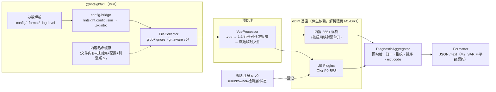

# lintsight · M1 技术设计文档（oxlint 基座 + Bun 封装）v0.1

> 版本：v0.1（草案，待评审） · 日期：2026-09-15
> 上游依据：[requirements-v0.2.md](../requirements/requirements-v0.2.md)（§2.1 M1 定案、§3 架构、§11 MVP 草图、§8.2 里程碑）+ [spikes/vertical-slice-m1.md](../spikes/vertical-slice-m1.md)（竖切验证报告，含 `bun build --compile` 追加实测）
> 读者：引擎研发团队、SAST 平台团队
> 定位：M1 动工前的实现设计——把 v0.2 总体设计收窄为 M1 可执行边界，冻结 M1 接口形状与关键决策。非 API 手册。
> 修订记录：
> - v0.1（2026-09-15）：初稿。吸收竖切验证结论（SV1~SV7 + compile 追加实测），全部 M1-DR 决策均附实测证据链接。
> - v0.1①（2026-09-15）：S1/S2 实施落定 + T1.8 实测补充——oxlint overrides（`files`+`rules` 覆盖）**实测有效**，§9 风险项关闭；规则值为 `allow/error/warn`（`off` 由 config-bridge 翻译为 `allow`）；规则选项数组 `["error", {...}]` 有效；jsPlugins 支持绝对路径（生成的 .oxlintrc 写入 `.lintsight-cache/`）。开放问题 1 拍板：**M1 不支持通配 severity**（oxlint 规则键无通配语义，config-bridge 校验显式拒绝，须逐条列举）。包结构按 §4 拆分为 6 个 workspaces 包并迁移测试。

---

## 1. M1 目标与验收边界

**一句话**：oxlint 基座全量复用 + 自有差异化规则以 JS Plugin 铺开 + Vue processor + 平台可消费的 JSON 报告。

| 项 | 内容 |
| --- | --- |
| 范围内 | 收集/解析/内置 865+ 规则（oxlint）；自有 P0 规则 ~25~30 条（正确性 ~10 + 安全语法级 ~14，按 P0 清单评审结果）；Vue SFC（script 块）；`lintsight.config.json` → `.oxlintrc` 翻译；JSON/文本报告、CLI、RuleTester、基础内容哈希缓存、规则注册表 v0 |
| 范围外 | taint/DFG/跨文件深度分析（M2）；`--type-aware`/tsgolint（M2，spike ③ 未完成前 M1 不承诺 type-aware 规则面）；SARIF（M2）；LSP/VS Code（M3）；远端缓存（M3） |
| 验收（§8.2） | 内部 ≥3 项目试用；万行库扫描 <10s；语料库（zod/dayjs 级）基线建立且双报率 0 |

## 2. 已消解的技术不确定性（设计输入）

| # | 竖切验证结论 | 对 M1 设计的影响 |
| --- | --- | --- |
| 1 | oxlint JS Plugins（alpha）可承载自有规则，ESLint v9 兼容 API 符合预期 | 规则轨道定案，`create`/visitor/report 接口形状冻结（M1-DR6） |
| 2 | oxlint `-f json` **无 messageId 字段**（内置与 JS 插件规则均无） | 指纹降级方案 + 文案 breaking 评审纪律（M1-DR2） |
| 3 | oxlint 自身 exit=1 有歧义（有 error / 输入不存在） | exit 0/1/2 语义由封装层自建（M1-DR3） |
| 4 | 并行扫描下诊断顺序不定 | 聚合层确定性排序，报告重跑逐字节稳定（M1-DR4） |
| 5 | Vue SFC「1:1 行号对齐虚拟块」方案 PoC 通过 | VueProcessor 主方案定案（M1-DR5） |
| 6 | `bun build --compile` 可行；oxlint npm 包为「Node wrapper + napi」形态；Bun 可直接运行 oxlint 入口 | 分发形态定案（M1-DR1）；FR-503 服务器仅需 Bun，无需 Node |
| 7 | oxlint 对绝对路径输入剥掉开头 `/`；`Bun.file().exists()` 对目录返回 false 等坑 | 桥接层防御性归一化清单（§4.4） |

## 3. 总体架构（M1 实际形态）



与 spike 代码的关系：**spike 产物是本架构的胚胎而非弃子**——`oxlint-bridge.ts`→diagnostic-bridge、`pipeline.ts`→cli 编排、`vue-processor.ts`→VueProcessor、`plugins/lintsight-rules/`→rules-core 首条规则。S1 切片按本文档重构为正式模块（补齐错误处理、配置面、缓存），不推倒重来。

## 4. 模块设计

### 4.1 `@lintsight/cli`（Bun，进程编排）

- 参数：`lintsight [paths...] [--config <file>] [--format json|text] [--log-level debug|info|warn|error]`。M1 不做 watch/增量参数面（缓存自动生效即可）。
- 编排流程：解析参数 → config-bridge 产出 `.oxlintrc` → 收集（`Bun.Glob`，忽略 `node_modules/.git/dist/build/coverage/.lintsight-cache`）→ .vue 虚拟化 → spawn oxlint `-f json --config` → 归一/回映射/指纹/排序 → formatter → exit code。
- 缓存（基础版）：键 = `sha256(文件内容 + 规则集指纹 + 配置指纹 + oxlint版本 + lintsight版本)`，值 = 该文件诊断数组；命中直接复用。**跨文件影响域不做**（M2），monorepo 按文件粒度即可满足 M1 性能预算。
- 可观测：`--log-level` 分级日志；M1 暂不做 `--profile`（oxlint `--debug timings` 直读即可）。

### 4.2 `@lintsight/config-bridge`

- 输入 `lintsight.config.json`（JSONC，schema 见 §6）→ 输出 `.oxlintrc.json`（写到 `.lintsight-cache/`，spawn 时经 `--config` 传入，不污染项目根）。
- **内置启用映射清单**（§8.2 修订⑥ 口径）：一个受版本管理的映射文件（`packages/config-bridge/src/builtin-mapping.ts`），声明「内置规则/类别 → lintsight 默认启用集」，config-bridge 据此合成 `.oxlintrc` 的 `rules` 段；同时输出等价报告（✅ 直接映射 / 🔄 需手写 / ➖ 无对应）供迁移与评审。
- 翻译规则：`category: 'error'|'warn'|'off'` → oxlint `-D/-A` 等价规则串；`overrides[].files` glob → oxlint `overrides` 段（oxlint 1.83 支持 overrides，需在 S2 实测核对字段）。
- ❌ M1 不做 `lintsight migrate --from eslint`（M2，FR-502）。

### 4.3 `@lintsight/vue-processor`（正式版要求）

- 主方案沿袭 M1-DR5：提取 `<script>` 块 → 生成与原文件**行号 1:1 对齐**的虚拟文件（非 script 行置空）→ 就地临时文件写入 `.lintsight-cache/vue/<相对路径>.vue.ts`。
- 就地约定的目的（§11.2）：保 `.vue` 的路径上下文供 import 解析正确（依赖项目 tsconfig/别名时不再退化）。
- 支持面：`<script>` / `<script setup>`，`lang="ts|js"`；不支持场景**显式报错跳过该文件**（不静默漏扫）：同行开标签、`src` 外链、多 script 块（M1 取首个 setup 块，其余告警）。
- safe fix 逆映射回写：**M1 后期切片**（S5），依赖 oxlint JSON fix 结构实测，不在第一版承诺。

### 4.4 `@lintsight/diagnostic`（diagnostic-bridge 正式化）

- 统一诊断模型（contractVersion 起始 `"1"`，字段变更必须递增并以快照锁定）：

```ts
interface LintsightDiagnostic {
  contractVersion: string;
  ruleId: string;            // 归一化后 "lintsight/<name>" | "eslint/<name>" | ...
  severity: 'error' | 'warning' | 'advice';
  message: string;           // 渲染文本（指纹成分之一，见 M1-DR2）
  file: string;              // 相对项目根 POSIX 路径（.vue 已回映射）
  span: { offset: number; length: number; line: number; column: number };
  fingerprint: string;       // sha256(M1-DR2 口径)
  owner: 'oxlint-native' | 'lintsight-js';  // 注册表联动，§4.6
}
```

- 防御性归一化清单（全部来自竖切实证）：ruleId `plugin(rule)`→`plugin/rule`；filename 双候选路径归一（绝对输入剥 `/`）；项目根去尾斜杠；目录存在性用 `node:fs stat`；并行输出确定性排序 `(file, offset, ruleId)`。

### 4.5 `@lintsight/rule-sdk` + `@lintsight/rules-core`

- rule-sdk M1 范围：`defineRule`（类型补全 + meta 契约校验）、`RuleTester`（bun test 承载：一次 spawn 扫多 fixture、按文件断言位置与 fix）、类型面只暴露 ESLint 兼容 API（铁律 2）。
- meta 契约（FR-203，缺一拒合）：`category / severity / confidence / typeRequirement(none|local) / tags(cwe/owasp) / docs(description+rationale+examples+falsePositives) / messages(messageId)`。**messageId 为强制字段**——即使 JSON 输出拿不到，也保留结构化能力供 M2 平台契约与 AI 研判消费。
- rules-core：按 category 拆子目录，物理 id 统一 `lintsight/<rule-name>`；首批规则清单以「P0 规则清单评审」结论为准（M0 交付物）。
- `createOnce` 性能 API：M1 先不采用，待 timings 数据显示热点规则后再迁（上游官方建议路径）。

### 4.6 规则注册表 v0（双报消解前置）

- 登记四元组：`ruleId / owner引擎 / 检测层(syntax|local|taint) / 状态(active|retired)`，载体为 `packages/diagnostic/src/registry.ts` 静态清单 + CI 校验（rules-core 每条规则必须在册，ruleId 一致）。
- M1 消解动作最小版：同名升级即换宿主（JS 版标 retired）+ 接管对映射登记（如 `lintsight/no-floating-promise` → `typescript/no-floating-promises`，M2 生效但 M1 先建表）；不同 ruleId 同 span 不合并，输出 `dedupGroup` 预留字段。
- 验收口径继承 §3.6：语料库断言双报率 0。

## 5. 关键设计决策（M1-DR，含备选与理由）

### M1-DR1 分发形态：oxlint 为伴生依赖，lintsight 本体双形态

- **决策**：lintsight 以 npm 包（`bun add @lintsight/cli`）为主要分发形态；`bun build --compile` 单文件（59MB 实测）作为 CI/worker 快速部署形态。oxlint 一律为**伴生依赖**，运行时解析链：`OXLINT_BIN 环境变量 → cwd/node_modules/.bin/oxlint → monorepo 开发态路径`（`resolveOxlintBin`）。
- **备选否决**：① 把 oxlint 嵌入 compile 单文件——实测不可行：oxlint npm 包是 Node wrapper + napi 绑定链，不是独立二进制（spike 报告「追加实测」节）；② 引擎侧进程内 require oxlint JS API（省一次 spawn）——诱人但绑定 oxlint 内部 JS 层结构，alpha 期风险大，**记为 M1.5 评估项**。
- **依据**：spike T1~T5 全过；T4 佐证伴生形态下引擎行为正确。FR-503 部署要求由「Bun 可直接跑 oxlint」满足，服务器仅需标准化 Bun 版本。

### M1-DR2 指纹：hash(ruleId + file + span + message)，message 文案纳入 breaking 纪律

- **决策**：M1 指纹 = `sha256(ruleId\0file\0offset:length:line:column\0message)`；规则 `messages` 文案变更视同 messageId 增删改名，走显式评审。
- **备选否决**：等 oxlint JSON 补 messageId——上游无排期承诺，阻塞 M1 平台对接不划算。
- **依据**：spike ④ 实证 JSON 无 messageId 字段；messageId 仍强制保留在 meta（§4.5），上游补齐后指纹口径可平滑升级（届时 contractVersion 递增 + 全量重扫通知平台）。

### M1-DR3 exit code：0/1/2 由封装层自建，不透传 oxlint 退出码

- **决策**：0=无 error；1=存在 error 级诊断；2=运行错误（输入不存在/无可扫文件/oxlint 不可得/JSON 不可解析），运行错误路径**禁止异常逃逸**（compile 实测抓到过该 bug）。
- **依据**：oxlint 对「输入不存在」也 exit=1，无法区分"代码坏"与"工具坏"（§6.3 原始诉求）。

### M1-DR4 报告确定性：排序 + 无易变字段

- **决策**：诊断按 `(file, span.offset, ruleId)` 排序；报告不含时间戳/线程数等易变字段；JSON 快照测试锁定。
- **依据**：并行扫描顺序不定的实测；"重跑指纹一致"是平台抑制同步与历史对比的地基。

### M1-DR5 Vue：1:1 行号对齐虚拟块（非 sourcemap 方案）

- **决策**：非 script 行置空保持行号一致，回映射零成本；不支持场景显式报错。
- **备选否决**：sourcemap 回映射——实现重、调试难，且列偏移收益在 script 块场景几乎为零（代码天然整行布局）。
- **依据**：spike SV5 位置回映射断言全过；同行开标签等边界的处理策略已实测定义。

### M1-DR6 JS Plugins alpha 风险对冲

- **决策**：oxlint 版本精确锁定（`"1.83.0"` 无脱字符）+ 语料库 diff 门禁 + 升级走 version-policy 门禁流程；规则 meta 强制 `messages` 结构化。
- **依据**：alpha 状态是 §8.3 登记风险；锁版本+门禁是既定缓解，M1 额外要求：**升级 oxlint 必须重跑竖切测试套件**（13 例 + 指纹稳定性，分钟级成本）。

### M1-DR7 内置规则启用策略：映射清单驱动，不开 nursery

- **决策**：M1 默认启用集 = correctness 基线（recommended）+ 映射清单显式声明的补充项；nursery 永不默认开（配置语义随 patch 漂移，破坏确定性，oxc-toolchain skill 铁律）。
- **依据**：FR-201；spike 实测默认即 96~97 条规则面，扩面通过映射清单受控演进。

## 6. 配置模型（`lintsight.config.json`）

```jsonc
{
  "$schema": "https://lintsight.dev/schema/v1.json",   // M1 提供本地 schema 文件即可
  "rules": {
    "lintsight/no-empty-catch": "error",
    "lintsight/no-hardcoded-credentials": ["error", { "entropy": true }],
    "security/no-unsafe-regex": "warn"                  // 内置规则经映射清单以原名/别名启用
  },
  "ignore": ["dist/**", "**/*.min.js"],
  "overrides": [
    { "files": ["**/*.vue"], "processor": "@lintsight/vue" },
    { "files": ["src/legacy/**"], "rules": { "lintsight/*": "warn" } }
  ]
}
```

- 翻译由 config-bridge 完成，`processor` 字段触发 VueProcessor；schema 校验失败报友好错误（列名+期望值），不静默忽略。
- open question（评审拍板）：`lintsight/*` 通配 severity 覆盖是否进入 M1（oxlint overrides 语义需实测）。

## 7. 测试与质量（M1 落地）

| 层 | 手段 | M1 要求 |
| --- | --- | --- |
| 规则单测 | RuleTester（bun test 承载，spike 模式推广）：valid/invalid fixture + 位置断言 | 每条 ≥3 bad / ≥2 good / safe case / 边界矩阵（含 .vue 用例） |
| 引擎单测 | bridge 归一化、指纹稳定性、exit code 三态、缓存键、Vue 边界 | 覆盖 §4.4 全部防御项 |
| 快照 | JSON 报告逐字节快照 | schema 变更显式 review |
| 语料库回归 | corpus/（zod/dayjs 级先行）+ 基线脚本 + diff 评审 | 每次发版必跑；oxlint 升级必跑 |
| 真实试用 | 内部 ≥3 项目月度扫描，人工标注误报 | 反哺 confidence 分级 |

性能校准：以语料库实测校准「万行 <10s」预算（§3.5 M1 目标），不达标先查 spawn 开销与缓存命中。

## 8. 里程碑内切片（M1 todo 的直接输入）

| 切片 | 内容 | 关键验收 |
| --- | --- | --- |
| S1 竖切正式化 | spike 代码 → 正式模块（§4.1/4.4 结构）、错误处理补全、contractVersion="1" 快照 | 现有 13 测试全绿迁移 + 新增防御项单测 |
| S2 config-bridge | §6 schema + 翻译 + 内置启用映射清单机制 | 翻译单测 + overrides 实测核对 |
| S3 规则第一批 | 正确性 ~10 条（P0 清单评审后） | 每条 RuleTester 契约 + 注册表登记 |
| S4 规则第二批 | 安全语法级 ~14 条 | 同上 + cwe tags 核对 |
| S5 Vue 正式版 | 就地临时文件、多块策略、fix 逆映射（若 oxlint fix 结构实测可行） | .vue 用例位置断言 + fix 收敛断言 |
| S6 缓存 + 性能 | 内容哈希缓存、语料库基准（hyperfine） | 万行库 <10s；回退 >15% 门禁 |
| S7 试用与基线 | 3 内部项目接入、语料库基线、双报率断言 | §1 验收表全项通过 |

依赖链：S1 → S2 → S3/S4（并行）→ S5 → S6 → S7。S3/S4 期间 rule-sdk 接口冻结评审（RFC，对外承诺最难点）必须在 S3 开工前完成。

## 9. 风险与开放问题

**风险**（继承 §8.3，M1 相关子集）：

| 风险 | 缓解 |
| --- | --- |
| JS Plugins alpha 行为漂移 | M1-DR6：锁版本 + 语料库 diff + 升级重跑竖切套件 |
| 内置规则噪音污染报告（correctness 基线全开） | 映射清单灰度；`dedupGroup` 预留；试用项目反馈驱动降级 |
| ~~overrides/glob 语义与预期不符~~ | **已关闭（v0.1①）**：overrides `files+rules` 实测有效 |
| 万行 <10s 不达标 | 缓存 + spawn 开销剖析（必要时进程内 require 评估提前，见 M1-DR1 备选②） |

**开放问题**（评审拍板）：

1. ~~§6 通配 severity 覆盖是否进 M1？~~ **已拍板（v0.1①）**：不支持——oxlint 规则键无通配语义，config-bridge 校验显式拒绝通配 key，规则须逐条列举。
2. 内置启用映射清单的默认集范围（correctness only vs +suspicious 试点）？
3. `OXLINT_BIN` 之外是否需要 `LINTSIGHT_NO_FIX` 之类安全开关（CI 场景防误修）？
4. no-empty-catch `allowComments` 选项（spike 遗留）随 S3 评审定案。
