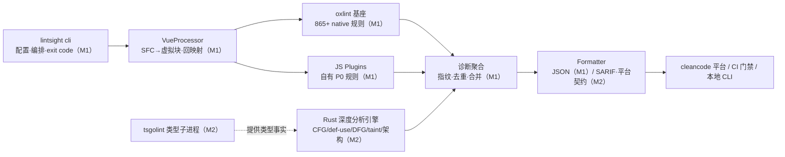

# lintsight · JS/TS 静态分析引擎 · 需求文档 v0.1

> 版本：v0.1 · 日期：2026-09-14 · 状态：评审中
> 上游：《技术设计文档》v0.2（[design.md](../design.md)）——选型论据、架构权衡、附录 C 平台契约见该文档；本文档只定义**做什么、做到什么程度、怎么算做完**。
> 管理约定：需求以 `FR-`/`NFR-` 编号管理，里程碑交付物必须能映射到编号；需求变更需升版本号并记录修订。

---

## 1. 背景与目标

公司 SAST 平台（cleancode）对 JS/TS 代码库缺少深度静态分析内核：ESLint 生态在数据流/污染追踪、跨文件架构约束、平台化闭环（指纹、抑制同步、AI 研判证据链）上存在结构性空缺。本引擎以 **oxlint 为语法级规则基座，自建 Rust 深度分析引擎补齐数据流能力**，作为平台扫描内核交付。

**目标一句话**：半年内产出「oxlint 基座 + 自有 P0 规则 + Vue 支持」的 MVP（M1），再以 Rust 深度分析引擎补齐 taint/架构能力（M2），对接平台完成「扫描 → 路径展示 → 复核 → 抑制」闭环。

**成功度量**（M2 后验收，详见 NFR）：高危规则误报率 <10%、平台复核确认率 >80%、内部 ≥20 项目接入、CI 有效拦截数月度上升。

## 2. 已确认的技术路线（决策记录）

以下决策已随设计文档 v0.2 评审定案，需求与实现不得偏离；变更需重新评审。

| DR | 决策 | 内容 | 关键理由 | 否决/推迟项 |
| --- | --- | --- | --- | --- |
| DR-1 | M1 引擎形态 | **oxlint 基座 + Node 薄封装**（配置翻译、Vue processor、诊断桥接），不自建 Node 内核 | 白捡 865+ 内置规则，最快可用；自有规则走 ESLint 兼容 API 可迁移 | 自建 Node 引擎（重复造轮子，已从设计中删除） |
| DR-2 | M2 深度分析形态 | **Rust 深度分析引擎（sidecar）**，基于 oxc crates 直连，与 oxlint 组成双引擎，诊断在报告层合并；不重建 oxlint 规则宿主 | 聚焦差异化（DFG/taint/架构），维护面最小；避免三个月重建内核的排期风险 | 整体收编 oxlint 重建全功能内核（M3 后按维护成本再评估） |
| DR-3 | 语言与运行时 | 深度引擎用 Rust（OXC 无其他语言库级 binding）；规则层双轨：JS（ESLint 兼容 API）+ Rust（IR API） | 进程内消费 oxc_parser/semantic/cfg | Go 内核（无 binding）、纯 Node（性能天花板） |
| DR-4 | 类型感知 | tsgolint（stable v7，59/61 type-aware 规则）首选；tsc Program 兜底；**TS7 不支持 `baseUrl`**，存量项目引擎侧别名解析兜底 + typeRequirement 自动降级 `local` | 性能 12~18x，与 OXC 同生态 | 自建轻量类型推导（覆盖低）作无 tsconfig 场景降级 |
| DR-5 | Vue 支持 | 自建 VueProcessor：SFC 拆虚拟块喂入 oxlint + 诊断位置回映射；script 块 M1，template 表达式 M2 | oxlint 无 processor 扩展点、JS Plugins 不支持 `.vue`，必须自建 | 依赖 vize bridge 作为主方案（单点依赖上游个人项目，仅作 spike 参考） |
| DR-6 | 契约先行 | 平台「路径跟踪」输出契约（设计文档附录 C）与诊断指纹模型先于 taint 引擎冻结 | 平台对接零返工，M2 竖切可直接在现有前端渲染 | 先做引擎后补契约 |

**架构总览**（组件后的里程碑标签为交付时间）：

## 3. 用户与使用场景

| 用户 | 场景 | 关键诉求 | 对应需求 |
| --- | --- | --- | --- |
| SAST 平台（cleancode） | 引擎作为扫描内核被调度（CLI 短进程 + 长驻 worker） | 结构化报告、稳定 exit code、指纹/路径契约 | FR-4xx |
| 业务研发 | 本地 CLI 扫描、PR 前自测 | 快（增量 <5s）、误报少、可一键修复 | FR-1xx/2xx、NFR-1 |
| CI/CD 门禁 | MR 拦截 | 高危高置信、SARIF、只报新增问题 | FR-403/402/406 |
| 平台/安全团队 | 编写维护规则 | checker SDK 好用、规则可灰度、误报反馈闭环 | FR-7xx、FR-405 |

## 4. 需求约定

- **优先级**：P0 = 该里程碑不交付即里程碑失败；P1 = 里程碑内尽力交付，可顺延一个里程碑；P2 = 择机。
- **里程碑**：M0 准备（~1 月）→ M1 MVP（~3 月）→ M2 可用（~4 月）→ M3 企业级（持续）。
- **关键词**：本文档中「必须/不得」为强制，「应该」为默认遵守可例外评审，「可以」为可选。

## 5. 功能需求

### 5.1 扫描与解析（FR-1xx）

| ID | 需求 | 优先级 | 里程碑 | 验收标准 |
| --- | --- | --- | --- | --- |
| FR-101 | 文件收集：glob + ignorePatterns + git aware（尊重 .gitignore），默认排除 node_modules/dist/build 产物 | P0 | M1 | 10 万+文件 monorepo 收集 <2s；产物目录 0 误入 |
| FR-102 | JS/TS 解析：TS 5.x、JSX/TSX、ESM/CJS、standard 装饰器；单文件解析失败降级为诊断而非中断扫描 | P0 | M1 | 兼容性矩阵（NFR-3）全绿；怪文件不致扫描失败（fuzz 语料 0 crash） |
| FR-103 | Vue SFC script 块分析（含 `<script setup>`、`lang="ts"`），诊断位置精确映射回 `.vue` 源文件 | P0 | M1 | 公司 3 个 Vue 项目扫描，抽样 100 条诊断位置 0 错位 |
| FR-104 | Vue template 指令内表达式抽取分析（v-if/v-for/v-bind 等） | P1 | M2 | 表达式内注入类规则可触发且位置正确 |
| FR-105 | 配置解析：JSONC + JSON Schema 校验，错误信息给出文件/字段/修复提示 | P0 | M1 | 非法配置报错可定位到字段级 |

### 5.2 规则体系（FR-2xx）

| ID | 需求 | 优先级 | 里程碑 | 验收标准 |
| --- | --- | --- | --- | --- |
| FR-201 | 内置规则基线：oxlint 内置规则全量可配置启用，默认 recommended（correctness 为主） | P0 | M1 | recommended 集合在语料库上 0 crash、误报可忽略 |
| FR-202 | 自有 P0 规则 50 条（JS 轨道，ESLint 兼容 API）：correctness ~30 条 + security 语法级 ~18 条 + architecture 轻量 2 条；清单先与 oxlint 内置去重后定稿（候选池见附录 A） | P0 | M1 | 每条 ≥3 bad / ≥2 good 用例；语料库人工抽检误报率：correctness <5%、security <10% |
| FR-203 | 规则元数据完备：category/severity/confidence/typeRequirement/docs（含 falsePositives）/cwe·owasp tags；缺字段禁止合入 | P0 | M1 | CI schema 校验门禁 100% 通过 |
| FR-204 | 规则分级与灰度：recommended/strict 预设集；规则可按项目/目录灰度启用 | P1 | M1 | 灰度配置在一个试点项目生效 |
| FR-205 | Rust 轨道规则接口：`createProgramRule(ctx)` + IR 查询面（CFG/DFG/imports），JS/Rust 轨道共用诊断模型 | P0 | M2 | 首批 taint 规则全部经此接口实现 |
| FR-206 | 自动修复分级：safe（--fix）/ suggestion（IDE code action）/ dangerous（显式开关）；fix 循环上限 10 轮 | P0 | M1（safe 基础） M3（全量） | fix 后语料库诊断数单调不增；冲突区间检测有单测 |

### 5.3 深度分析（FR-3xx，M2 核心价值区）

| ID | 需求 | 优先级 | 里程碑 | 验收标准 |
| --- | --- | --- | --- | --- |
| FR-301 | CFG 构建（基于 oxc_cfg）+ def-use 链自建，供路径敏感规则查询 | P0 | M2 | 语料库构建成功率 ≥99.9%；与人工断言样本一致 |
| FR-302 | 过程内 DFG/taint 引擎：source / sanitizer / sink 模型，路径事件流输出（附录 C 事件分类） | P0 | M2 | M2 批次 taint 规则误报率 <15%（平台复核口径） |
| FR-303 | 首批 taint 规则 5~8 条：XSS（innerHTML sink）、原型污染（merge sink）、路径穿越、SSRF（URL sink）、命令注入、SQL 模板拼接；每条带 cweTags 与 evidenceChain | P0 | M2 | 竖切规则在 cleancode-sast-web「路径跟踪」tab 逐节点可点击定位 |
| FR-304 | 跨文件架构规则：分层 import 约束、禁止依赖、循环依赖、公共 API 泄漏；模块解析对齐 tsconfig（paths/references/exports），baseUrl 项目走引擎侧别名兜底 | P0 | M2 | 公司 monorepo 分层违规检出正确，别名解析 0 误判（抽样验证） |
| FR-305 | 类型感知集成：tsgolint 子进程接入；`program` 级规则首批仅 no-floating-promises / unsafe-any 两类；不满足 TS7/baseUrl 条件自动降级并提示 | P1 | M2 | 降级路径有明确提示；tsgolint 规则误报与 typescript-eslint 差异可解释 |

### 5.4 报告与平台对接（FR-4xx）

| ID | 需求 | 优先级 | 里程碑 | 验收标准 |
| --- | --- | --- | --- | --- |
| FR-401 | 统一诊断模型：ruleId/message/位置/severity/confidence/**fingerprint**（ruleId+位置+语义位置哈希）/cweTags | P0 | M1 | 同代码同配置两次扫描指纹一致率 100% |
| FR-402 | 输出格式：JSON（M1）；SARIF 2.1.0、GitLab CodeQuality JSON（M2）；schema 快照测试 | P0 | M1/M2 | SARIF 可被 GitHub Code Scanning 原生导入 |
| FR-403 | 退出码语义：0 无问题 / 1 有 error / 2 运行错误（与诊断严格区分） | P0 | M1 | CI 场景「代码坏」与「工具坏」可区分 |
| FR-404 | 平台路径跟踪契约（设计文档附录 C）：PathEvent/TaintFinding 模型、多路径输出、超长路径折叠、issueId 稳定（重扫可关联历史） | P0 | M2 | 平台前端双轨渲染正常（aiGenerated=1）；issueId 跨扫描稳定 |
| FR-405 | 抑制机制：行内 `// lintsight-ignore-next-line: reason` + 指纹与平台白名单双向同步 | P1 | M2 | 抑制后重扫 0 复现；平台登记与引擎双向一致 |
| FR-406 | 「只报告新增问题」模式：对比基线分支，存量项目接入不被历史问题淹没 | P0 | M2 | 试点存量项目 CI 仅新增问题告警 |

### 5.5 配置与迁移（FR-5xx）

| ID | 需求 | 优先级 | 里程碑 | 验收标准 |
| --- | --- | --- | --- | --- |
| FR-501 | 配置模型：JSONC 单文件，flat 风格按 glob 分组 + overrides（规则/processor 均可覆盖） | P0 | M1 | 一个配置文件覆盖 monorepo 多 package 场景 |
| FR-502 | 迁移工具 `lintsight migrate --from eslint`：生成初版配置 + 规则等价映射报告（✅ 直接映射 / 🔄 需手写 / ➖ 无对应） | P1 | M2 | 对试点项目 eslint.config 生成可用映射报告 |
| FR-503 | 长驻 worker 服务模式：承接平台任务队列，复用类型与缓存 | P1 | M2 | 平台调度走服务化模式，大仓二次扫描免冷启动 |

### 5.6 集成（FR-6xx）

| ID | 需求 | 优先级 | 里程碑 | 验收标准 |
| --- | --- | --- | --- | --- |
| FR-601 | 官方 CI 模板：GitHub Actions / GitLab CI（含 SARIF 上传、新增问题模式） | P1 | M2 | 一条模板可在试点 CI 直接复用 |
| FR-602 | LSP server：诊断推送、hover 规则说明、code action | P1 | M3 | VS Code 插件 alpha 可用 |
| FR-603 | watch 模式：FSEvents/chokidar + 内存缓存，交互延迟 <2s | P2 | M3 | 本地开发场景可用 |

### 5.7 工程支撑（FR-7xx）

| ID | 需求 | 优先级 | 里程碑 | 验收标准 |
| --- | --- | --- | --- | --- |
| FR-701 | RuleTester SDK：valid/invalid fixture 对，断言诊断位置与 fix 输出；自有规则开发唯一入口 | P0 | M1 | 50 条 P0 规则全部用它编写用例 |
| FR-702 | 语料库与基线：3 个真实仓库（小 zod 级 / 中 dayjs 级 / 大 Vue 级，含 1 个公司 monorepo）；基线脚本 + diff 评审流程；发版必跑 | P0 | M0（v0）→ M1（运转） | 规则结果变更必须附语料库 diff 与误报分析 |
| FR-703 | 基准流水线：hyperfine + codspeed，按 typeRequirement 分档统计 LOC/s；性能回退 >15% 拦截合并 | P1 | M1 | CI 周期跑，回退门禁生效 |
| FR-704 | monorepo 脚手架：pnpm + changesets + CI（test/lint/bench 门禁）；Rust 深度引擎以 crate workspace 纳入 | P0 | M0 | 新规则包脚手架一条命令生成 |
| FR-705 | 差分测试：与 ESLint/SonarJS 同类规则跑同语料，对比召回/误报 | P1 | M2 | 输出季度对比报告，作为规则质量标尺 |

## 6. 非功能需求（NFR）

| ID | 需求 | 验收标准 |
| --- | --- | --- |
| NFR-1 性能 | M1：万行库全量 <10s。M2：10 万行库全量 <60s、增量 <5s、≥15 万 LOC/s（none 类规则、单 worker 折算，M1 用语料库校准后冻结数字） | 基准流水线持续度量，回退 >15% 拦截 |
| NFR-2 可靠性 | 单文件解析失败降级为诊断；任何规则 crash 不中断整次扫描；crash = P0 bug 修复节奏 | fuzz 语料 0 crash；语料库扫描 0 中断 |
| NFR-3 兼容性 | TS 5.x（M2 +4.9 尽力而为）、Node 20.x/22.x、ESM+CJS、JSX/TSX、standard 装饰器（M2 +legacy）、Vue 3 SFC | 兼容性矩阵进 CI 抽测 |
| NFR-4 可观测 | `--log-level` 分级日志；`--profile` 输出 per-phase/per-rule 耗时 JSON；错误上报脱敏 | profile 数据可定位前 10 热点规则 |
| NFR-5 安全 | 插件仅可访问 SDK 面（禁止引擎内部模块）；扫描默认不外传代码；错误上报含路径脱敏 | 插件沙箱边界有负向测试 |
| NFR-6 可维护 | `rule-sdk` API 变更走 RFC；低使用率规则进 maintenance 名单治理 | SDK breaking change 数 = 0（M1 冻结后） |

## 7. 里程碑与验收总表

| 里程碑 | 周期 | 交付范围（映射） | 出口标准 |
| --- | --- | --- | --- |
| M0 准备 | ~1 月 | 设计冻结；spike ①②③（oxc crate / Vue×JSPlugins / tsgolint 兼容性）结论落档；语料库 v0（FR-702）；P0 规则 50 条定稿（去重后）；脚手架（FR-704）；rule-sdk RFC | 三项 spike 均有数据结论；规则清单评审签字 |
| M1 MVP | ~3 月 | oxlint 基座全链路（FR-101/102/105、201、401/403）+ 自有 50 条规则（FR-202/203）+ Vue script（FR-103）+ JSON 报告 + RuleTester（FR-701）+ safe fix（FR-206） | 内部 ≥3 项目试用；万行库 <10s；竖切（1 条规则从 CLI 到 Vue SFC 到 JSON 诊断含指纹）走通 |
| M2 可用 | ~4 月 | Rust 深度分析引擎（FR-301~304、205）+ tsgolint（FR-305）+ SARIF/平台契约/抑制/新增问题模式（FR-402/404/405/406）+ 迁移工具与 CI 模板（FR-502/601）+ 长驻 worker（FR-503） | 10 万行库全量 <60s / 增量 <5s；taint 误报率 <15%；接入 ≥2 条 CI 门禁；平台路径跟踪 tab 可用 |
| M3 企业级 | 持续 | LSP/VS Code（FR-602）、跨文件 taint（调用图）、fixer 全量、远端缓存、AI 研判闭环、Vue template 深化 | 平台全量接入；月度误报率下降；采用 ≥20 项目 |

## 8. 范围外（Non-goals，引用设计文档 §1.3，任何变更需重新评审）

格式化（Prettier/Biome 职责）、打包/转译、运行时检测（DAST/IAST）、首期多语言（Java/Go）、依赖漏洞库（SCA 本体，仅供 import 事实）、AI 模型本体（只做被调用方与校验执行方）。

## 9. 开放问题（跟随 M0/M1 推进关闭）

| # | 问题 | 倾向 / 关闭条件 |
| --- | --- | --- |
| 1 | Vue 虚拟块喂入 oxlint 的具体机制（临时文件 vs 内存注入）与 vize bridge 复用度 | spike ② 关闭 |
| 2 | tsgolint 在 baseUrl 存量项目的降级策略默认值 | spike ③ 关闭 |
| 3 | template 表达式分析深度（仅注入类 vs 全量规则） | M1 末定 |
| 4 | M1 增量缓存的粒度（run 级 vs 文件级）与 oxlint 文件参数的配合方式 | M1 实现前定 |
| 5 | 架构规则分层配置格式（约定目录 vs 显式声明） | FR-304 设计评审定 |
| 6 | taint 路径截断阈值（默认 ≤32 步） | 平台前端走查后定 |

## 10. 术语表

| 术语 | 定义 |
| --- | --- |
| taint / source / sanitizer / sink | 污染传播分析：外部输入（source）经清洗（sanitizer）到达危险 API（sink） |
| fingerprint | 诊断稳定指纹（ruleId+位置+语义位置哈希），支撑平台历史对比与抑制登记 |
| confidence | 误报风险分级（high/medium/low），独立于 severity；CI 门禁只拦 error+high |
| typeRequirement | 规则所需类型深度：none / local / program |
| processor | 非 JS 文本 → 虚拟 JS 块 → 诊断位置回映射的扩展机制（Vue SFC 即此类） |
| def-use / DFG | 定义-使用链 / 数据流图，taint 分析的引擎层地基 |
| sidecar 双引擎 | oxlint（语法规则宿主）与自建 Rust 深度分析引擎并行、诊断合并的架构形态 |

---

## 附录 A · 自有 P0 规则候选池（~45 条，M0 与 oxlint 内置去重后定稿 50 条）

> 检测层标注：`none`=纯语法、`local`=局部类型/作用域推导。标注 ◆ 的规则在 M2 升级为 taint 实现（**规则 ID 不变，confidence 上调**）。

### correctness（~22 条）

| 规则 ID | 检测层 | 说明 |
| --- | --- | --- |
| no-await-in-non-async | none | await 出现在非 async 函数 |
| no-floating-promise | local | 未处理的 Promise 表达式语句 |
| no-empty-catch | none | 空 catch 吞错 |
| no-swallowed-promise-error | local | catch 仅 console/空吞 Promise reject |
| no-then-without-catch | local | then 链无 catch/onRejected |
| eqeqeq-null-only | none | 仅允许 `== null` |
| no-closure-loop-trap | none | 循环内 var 闭包捕获陷阱（提示 let） |
| no-async-promise-executor | none | Promise executor 内使用 await |
| no-promise-executor-return | none | executor 返回值被忽略 |
| no-conditional-assignment | none | 条件表达式内赋值 |
| no-constant-condition-literal | local | 字面量常量条件 |
| no-compare-neg-zero | none | 与 -0 严格比较 |
| no-self-compare | none | 自比较 |
| no-self-assign | none | 自赋值 |
| no-dupe-else-if | none | 重复 else-if 条件 |
| no-fallthrough | none | switch 穿透无注释 |
| no-unmodified-loop-condition | local | 循环条件变量不更新 |
| no-template-curly-in-string | none | 普通字符串内的 `${}` 占位误用 |
| no-unsafe-negation | none | `!` 与 in/instanceof 优先级 |
| no-array-index-key | none | 数组下标作组件 key |
| require-await | none | async 函数无 await（提示级） |
| no-useless-catch | none | catch 原样 rethrow |

### security · 语法级（~18 条，◆ 者 M2 升级 taint）

| 规则 ID | 检测层 | 说明 |
| --- | --- | --- |
| no-hardcoded-credentials | none | 熵 + 正则检测密钥/密码字面量 |
| no-secret-in-url | none | URL 中携带凭证 |
| no-eval / no-new-function | none | 动态代码执行 |
| no-unsafe-regex | none | ReDoS 静态特征（嵌套量词等） |
| no-child-process | none | 子进程 API 调用面（审慎名单） |
| no-postmessage-wildcard | none | postMessage targetOrigin `*` |
| no-innerhtml-assignment ◆ | none→taint | innerHTML/outerHTML 直接赋值 |
| no-document-write | none | document.write |
| no-prototype-polluting-merge ◆ | none→taint | 递归 merge 类 API key 可控 |
| no-path-traversal-join ◆ | none→taint | path.join 拼接外部输入 |
| no-ssrf-url-from-input ◆ | none→taint | fetch/axios URL 来自请求输入 |
| no-command-injection ◆ | none→taint | exec/spawn 参数拼接 |
| no-sql-template-injection ◆ | none→taint | SQL 模板字符串拼接查询 |
| no-math-random-token | none | Math.random 生成凭证/令牌 |
| no-insecure-hash | none | md5/sha1 用于安全场景 |
| no-tls-disable | none | rejectUnauthorized: false、NODE_TLS_REJECT_UNAUTHORIZED |
| no-cors-wildcard | none | Access-Control-Allow-Origin: * |

### architecture · 轻量（M1 先行 2 条，完整集 M2/FR-304）

| 规则 ID | 检测层 | 说明 |
| --- | --- | --- |
| no-deep-import | none | 禁止绕过包入口深引（`pkg/src/...`） |
| no-forbidden-dependency | none | 禁止依赖清单（按包名/正则） |

---

*变更记录：v0.1（2026-09-14）——基于设计文档 v0.2 首次成文，技术路线随 DR-1~6 冻结。*
