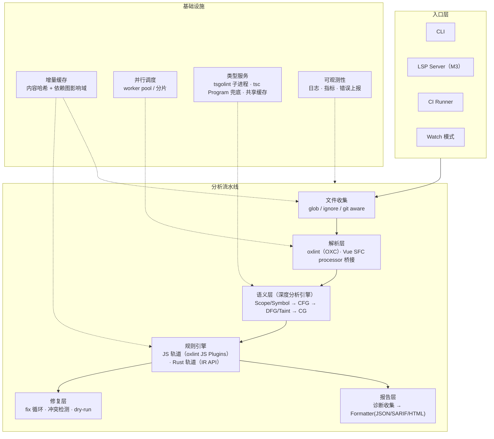
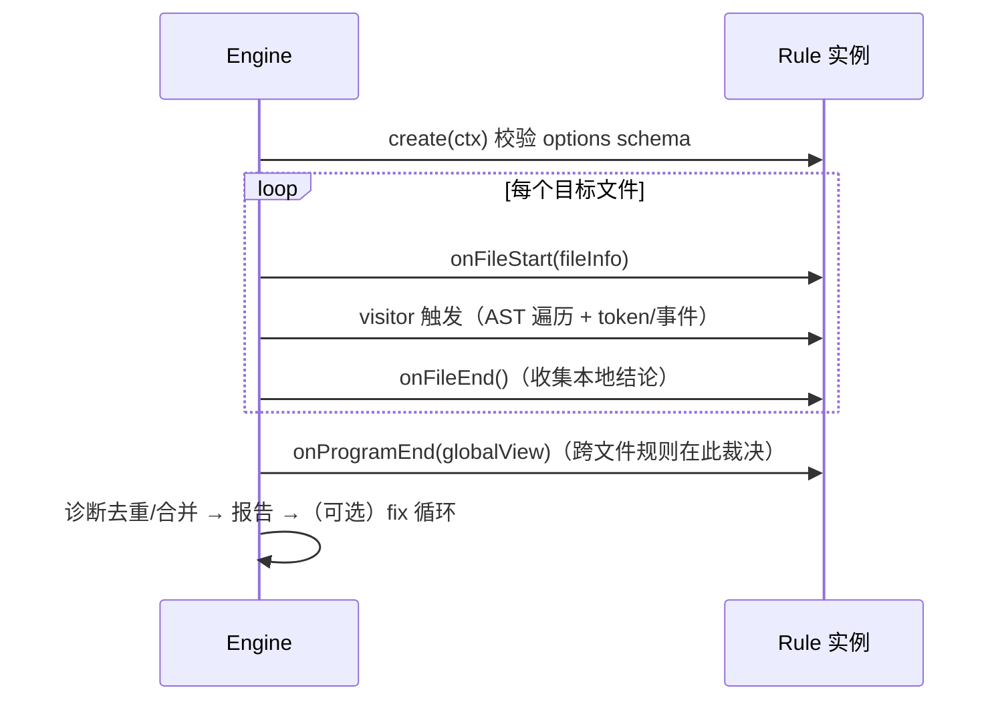
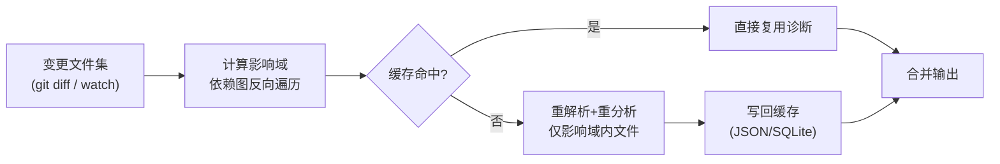
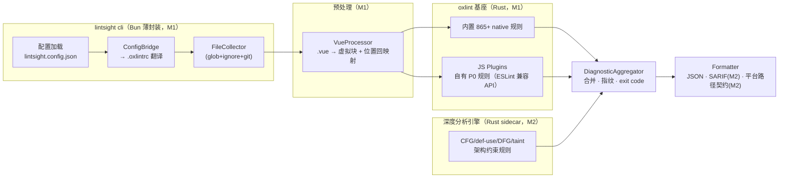

# lintsight · JS/TS 静态分析引擎 · 技术设计文档 v0.2

> 版本：v0.2（评审修订②） · 日期：2026-09-14 · 状态：技术路线已确认，随《需求文档 v0.1》（docs/requirements/requirements-v0.1.md）进入执行
> 修订记录（v0.1 → v0.2 修订①，落实评审结论）：
> ① 消除 §11 与 §2.1 的矛盾——M1 定案为 oxlint 基座 + Node 薄封装，删除自建 Node 引擎残留草图；
> ② M2 由「整体重建 Rust 内核」调整为「Rust 深度分析引擎（sidecar）+ oxlint」双引擎架构，不重建规则宿主，LSP 移至 M3；
> ③ M0 spike 清单补齐：Vue SFC × oxlint JS Plugins 集成 PoC、tsgolint 存量 tsconfig 兼容性实测；
> ④ 补充 tsgolint（TypeScript 7）不支持 `baseUrl` 的约束与降级方案。
> 修订记录（v0.2 修订②，评审定稿，落实第二轮评审 16 条）：
> ⑤ 规则数口径统一为 865+（2026-09 经 oxc.rs 核实），注明统计日期；⑥ P0 规则账目修正：候选池初审去重后改为「自有差异化 ~25~30 条 + 内置启用映射清单」（§4.1、§8.2）；⑦ 关闭附录 B #1（JS runtime 自建选型随 DR-1 失效），alpha 稳定性转入风险清单；⑧ 新增 §3.6 双引擎诊断重叠消解（规则归属矩阵 + 升级即换宿主）；⑨ M1 指纹锚点修正，新增 spike ④（oxlint JSON 诊断字段完备性）；⑩ rule-sdk 生命周期标注 M1/M2 生效范围（onProgramEnd 为 M2 钩子）；⑪ `program` 级规则直接启用 oxlint --type-aware（不自实现，§2.2）；⑫ Vue processor 补路径上下文与 fix 逆映射职责（§11.2）；⑬ M2 内部排序（架构规则先行 → taint 竖切），风险清单补 4 条外部依赖；⑭ 误报超标改「门禁拦截 + 人工决策」，附录 C 契约补 contractVersion / isMainTrace / hasSource 并锁定字符串类型。
> 修订记录（v0.2 修订④，2026-09-14）：⑮ 封装层运行时 Node → **Bun 绑死**（DR-7，见需求文档）：bun install/workspaces + bun.lock 提交、全面采用 Bun 专有 API（Bun.file/Bun.Glob 等）、**bun build --compile 单文件二进制**分发（业务侧零依赖安装、内嵌 runtime）、bun test 承载 RuleTester 与 CI；TS 配置文件顾虑消除（§6.4 评估提前至 M2）；兼容矩阵与服务器部署要求同步（§5.3/FR-503）；todo 新增 T0.13 Bun 运行时验证。
> 读者：引擎研发团队、SAST 平台团队、技术决策者
> 定位：动手写代码前的准备文档——目标边界、选型决策、架构设计、准备清单。本文档不是 API 手册，接口细节在 M0 阶段冻结。

---

## 0. 前置决策变量

引擎方案不是唯一的，以下变量直接决定推荐路径。**承接本设计前，先对齐这张表**：

| 变量 | 取值影响 | 本设计默认假设 |
| --- | --- | --- |
| 团队规模 | ≤3 人：纯 Node.js 起步，不做 Rust；≥6 人且有编译器/Rust 经验：混合架构 | 4~6 人，1 名有编译器背景 |
| 预算/周期 | 预算紧：MVP 收窄到安全规则；预算足：完整 IR 分期建设 | 半年内出可用版本 |
| 是否必须兼容 ESLint 生态 | 必须兼容 → 规则 API 做 ESLint 兼容层或直接分叉 lint 侧；不要求 → 自有 SDK | JS 轨道天然 ESLint 兼容（复用 oxlint JS Plugins 白捡）；Rust 轨道与自有 SDK 不承诺 ESLint API 兼容，提供迁移工具 |
| 目标代码库规模 | 万行：单进程即可；百万行：增量+并行必须；千万行：Rust 内核 + 分布式分片 | 百万行级（含公司 monorepo） |
| 是否要求 Rust 级性能 | 要求 → 深度分析引擎 Rust 化提上 M2；不要求 → Node worker_threads 够用 | Rust 深度分析引擎 + OXC 已定案（§2.4，sidecar 双引擎形态），规则层 JS/Rust 双轨对冲人才风险 |
| AI/LLM 需求 | 有 → 规则输出需结构化（供 LLM 消费）、预留置信度字段与复核闭环 | 有，对接 SAST 平台 AI 研判 |
| Vue 支持优先级 | 公司主栈是 Vue → SFC 解析（`<script setup>`、template）为 P0 而非加分项 | P0，MVP 必须支持 |

---

## 1. 目标与边界定义

### 1.1 核心定位

一句话：**面向企业级大规模 JS/TS 代码库的静态分析内核**，以「缺陷检测 + 安全扫描」为主轴，架构约束与代码度量为第二梯队，自动修复与 AI 辅助为渐进能力。

按优先级排序的能力集：

1. **缺陷检测（正确性）**：空引用、未处理 Promise、类型混淆逻辑错误等高置信度 bug 类。
2. **安全扫描（SAST）**：对齐 CWE/OWASP，基于数据流/taint 的注入类检测（XSS、原型污染、路径穿越、SSRF、硬编码凭证、依赖供应链入口）。这是公司 SAST 平台的硬需求，也是与 ESLint 拉开差距的核心。
3. **架构与依赖约束**：分层规则（禁止跨层 import、公共 API 泄漏、依赖方向）、依赖清单约束。
4. **代码度量**：复杂度、重复度、死代码、耦合度——输出给平台做趋势看板。
5. **自动修复**：safe fix 为主，dangerous fix 以 suggestion 形式呈现，AI 辅助重构放在远期。
6. **AI 辅助分析**：规则结果结构化输出 → LLM 研判降噪（对接 SAST 平台已有 AI 研判能力），引擎侧预留置信度与证据链字段。

### 1.2 目标用户与使用场景

| 用户 | 场景 | 关键诉求 |
| --- | --- | --- |
| SAST 平台（cleancode） | 引擎作为扫描内核被平台调度 | 结构化报告、稳定 exit code、可对接任务/缺陷模型 |
| 业务研发 | 本地 CLI + IDE 提示，PR 前自测 | 快（增量 <5s）、误报少、可一键修复 |
| CI/CD 门禁 | Merge Request 拦截 | 高危规则高置信度、SARIF 输出、退出码语义清晰 |
| 平台/安全团队 | 编写和维护规则 | checker SDK 好用、规则可灰度、误报可反馈闭环 |

### 1.3 非目标（明确不做）

> 范围蔓延是此类项目死亡的第一原因。以下每一条被提出时都应拒绝并引用本节。

- ❌ **不做格式化**：Prettier/Biome format 的职责，一个字都不碰。
- ❌ **不做打包/转译**：不替代 esbuild/Vite/SWC build pipeline（但可复用其解析器）。
- ❌ **不做运行时检测/DAST/IAST**：只做静态，动态验证交给平台其他模块。
- ❌ **首期不做多语言**：JS/TS（含 Vue SFC）之外（Java/Go/…）是另一个引擎的事，IR 设计预留语言中立性即可。
- ❌ **不做依赖漏洞数据库（SCA）本体**：只提供 import 事实给 SCA 消费，CVE 库不自建。
- ❌ **不做 AI 模型本体**：只做 AI 的被调用方（输出结构化诊断）与调用方（AI 修复建议的校验执行）。

---

## 2. 技术选型与基础设施

### 2.1 解析层：解析器对比与推荐

| 维度 | Babel (@babel/parser) | TypeScript Compiler API | SWC | OXC | Tree-sitter |
| --- | --- | --- | --- | --- | --- |
| 语言 | JS | TS | Rust | Rust | Rust (C 核心) |
| 性能 | 基准线（1x） | 慢（~0.3x） | ~30x | ~50x+ | ~40x |
| AST 生态 | ESTree 兼容，插件最全 | 自有 AST（tools API 丰富但部分内部 API 不稳定） | 近 Babel | 自有强类型 AST（区分 IdentifierReference/BindingIdentifier 等），序列化层支持 ESTree（oxc_estree） | 自有 CST，偏语法层 |
| TS/JSX/装饰器 | ✅ 全 | ✅ 全（事实标准） | ✅ | ✅（TS 完整度高，持续演进） | ⚠️ 靠 grammar 覆盖 |
| 容错解析 | ✅ recoverable | ✅ | ⚠️ 部分 | ✅ | ✅ 天生增量、错误容忍 |
| 类型信息 | ❌（需配 tsc） | ✅ 本体 checker | ❌ | ⚠️ 自建 type-aware 演进中 | ❌ |
| 风险点 | 性能天花板 | API 稳定性、内存占用 | 插件生态弱 | 版本迭代快、语义层未完全冻结 | 无 scope/symbol，不适合深度语义 |

**推荐（分阶段）：**

- **M1（MVP）**：**不自建内核，直接以 oxlint + JS Plugins 为基座**（865+ Rust 内置规则 + ESLint 兼容 JS 插件 API），自有规则用 JS/TS 编写，Vue SFC 走 processor。理由：CI 可用性与规则面铺开最快，自有规则天然 ESLint 兼容、可迁移。
- **M2（深度分析引擎）**：基于 OXC crate 自建 **Rust 深度分析引擎**（parser + semantic + cfg 进程内直连，在其上自建 def-use/DFG/taint），以 **sidecar 双引擎**形态与 oxlint 并行：oxlint 继续作为语法级规则宿主（不重建其规则调度与嵌入式 JS runtime），深度规则（taint/跨文件/架构约束）用 Rust native 实现，两引擎诊断在报告层合并。是否把 oxlint 整体收编进自家内核，推迟到 M3 之后按维护成本再评估。
- **关键架构约束**：从第一天起，**规则代码禁止直接依赖具体 parser 的 AST 类型**：JS 轨道走 ESLint 兼容 API 面，Rust 轨道走引擎 IR API 面——这是解析器可替换与双轨并存的唯一保障。

**OXC 已具备（2026-09 核实，可直接白捡）：**

| 能力 | 现状 | 对引擎的意义 |
| --- | --- | --- |
| 语义分析（oxc_semantic） | GA：scope chain、symbol table、reference tracking、dead code detection、ClassTable、JSDoc | 设计文档中的 L1 层免建 |
| CFG（oxc_cfg + oxc_semantic 可选 CFG） | GA：basic blocks、petgraph 图分析、DOT 导出、visitor 集成 | L2 层地基免建，DFG 可直接在其上构建 |
| 类型感知（tsgolint） | GA：基于 typescript-go，覆盖 59/61 typescript-eslint type-aware 规则；`oxlint --type-aware` | 类型事实不再依赖 Node 侧 tsc，性能与 Rust 内核同栈 |
| 多文件分析 | oxlint 一等公民：project-wide module graph、跨规则共享解析结果 | 跨文件规则的模块图白捡 |
| 现成规则面 | oxlint v1.x（stable）：865+ 规则，含 security 类（**口径：865+，2026-09 经 oxc.rs 核实**，随上游演进需更新） | M1 可直接以 oxlint 为规则面基线，自建规则聚焦其空缺 |

**OXC 未具备（需自建）：** DFG/def-use 链、taint 传播引擎（source→sanitizer→sink）、路径事件流输出（见附录 C）。oxc_cfg 提供 CFG 但没有可复用的数据流分析框架，oxlint 的安全规则基本停留在语法级/常量传播——这正是本引擎的差异化空间。

> ⚠️ OXC 两个注意点：① AST **不是** ESTree（自有强类型设计，如 IdentifierReference 与 BindingIdentifier 区分），规则抽象层不可避免，但换来了类型安全与遍历顺序确定性（按 ECMAScript 求值序）；② 上游迭代快（minor 版本即可能新增诊断），需锁定版本 + 语料库回归门禁。

### 2.2 类型信息（type-aware analysis）策略

| 方案 | 优点 | 缺点 | 结论 |
| --- | --- | --- | --- |
| A. 依赖 tsc（typescript API 建 Program） | 类型事实最全，行业惯例（ESLint typed rules 同路） | 大仓全量 Program 极慢（分钟级）、内存 GB 级 | Node 侧方案，仅作降级备选 |
| B. ts-morph | 封装好用 | 本质还是 tsc，多一层开销 | 不单独采用，工具函数层可选 |
| C. 自建轻量类型推导（local inference） | 快 | 覆盖低、易误报 | 仅作为无 tsconfig 场景的降级 |
| **D. tsgolint（typescript-go 驱动）** | typescript-go 性能远超 tsc（官方基准 12~18x）；与 OXC 同生态（2026-07 已发 stable v7，覆盖 59/61 type-aware 规则）；免 Node | **要求 TypeScript 7.0+（存量 TS5 项目需评估升级）；已不支持 `baseUrl` 等遗留 tsconfig 配置**；与自有缓存体系要做集成 | **M2 首选**，A 作为兜底 |

**推荐设计——「类型深度分级」**：每条规则在 meta 中声明所需类型深度，引擎据此决定给它什么上下文：

```ts
type TypeRequirement =
  | 'none'        // 纯语法/结构规则（大多数规则），无需 Program
  | 'local'       // 局部推导：本文件内可判定的类型事实
  | 'program';    // 需要 tsc Program（跨文件类型、泛型、 narrowing）
```

- `program` 级规则的代价：引擎为同一 tsconfig 建 Program 后**跨规则共享**，并按 tsconfig 内容哈希缓存；增量模式复用 tsc incremental 的 tsbuildinfo。
- MVP 期只实现 `none/local`，`program` 排 M2——避免第一版就被 tsc 性能拖死。
- **（v0.2 修订②）`program` 级规则直接启用 oxlint --type-aware（tsgolint）的 type-aware 规则集**（59/61 条，含 no-floating-promises / unsafe-any）——深度引擎**不自实现** type-aware 规则，省一个量级工作量；深度引擎仅消费类型事实做 taint 增强（M3 方向）。

### 2.3 AST / IR 设计

分层 IR，规则按需查询，**不要一次性全建**：

| 层级 | 内容 | 建设阶段 | 服务于 |
| --- | --- | --- | --- |
| L0 | AST（ESTree 兼容 + 源码映射 range） | M1 | 语法/结构类规则 |
| L1 | 作用域与符号表（scope、symbol、reference、import/export 绑定） | M1 | 命名、未使用变量、import 约束 |
| L2 | CFG（过程内控制流图）+ def-use | M1.5~M2（CFG 可直接用 oxc_cfg，仅 def-use 需自建） | 可达性、空指针路径敏感规则 |
| L3 | DFG / taint track（source → sink，经 sanitizer） | M2 | 注入类安全规则（核心价值区） |
| L4 | 调用图 CG（跨文件/跨包，先直接调用后方法解析） | M2~M3 | 跨文件污染传播、架构依赖、死代码 |

> ⚠️ 常见反模式：跳过 CFG/def-use 直接在 AST 上写数据流规则——路径不敏感会带来大量误报，且后期重写成本极高。L2 是 taint 的地基，不可省。

IR 与 AST 解耦（v0.2 修订）：M1 的 JS 轨道规则经 ESLint 兼容 API 面（由 oxlint 提供），M2 深度分析引擎直接消费 OXC AST/arena 并在其上构建 L1~L4。规则代码不得依赖任何具体 AST 类型——保证规则资产可跨引擎迁移，也是解析器可替换的唯一保障。

### 2.4 语言与运行时（已决策：Rust 内核 + OXC，规则层 JS/Rust 双轨）

**结论：深度分析内核用 Rust（OXC 同语言直连），以 sidecar 双引擎形态与 oxlint 并行（oxlint 保留为语法级规则宿主，不重建）；Go 不作内核语言，仅保留类型子进程的可选位；规则层双轨让前端团队不必全员学 Rust。**

| 方案 | 取舍 | 结论 |
| --- | --- | --- |
| **Rust + OXC（内核）** | 唯一能**库级**消费 OXC 的语言：oxc_parser / oxc_semantic / oxc_cfg 进程内直连、arena 零拷贝；oxlint 本身即此架构，生态成熟 | ✅ 定案 |
| Go + OXC（内核） | ❌ OXC **没有 Go binding**（crate 重度依赖 Rust arena/lifetime，cgo 包装不现实），Go 只能子进程/IPC 调 Rust 二进制——既丢库级集成优势，又多一层序列化边界，两头不占 | 否决 |
| Go（tsgolint 模式） | OXC 官方同款混合：Rust 内核 + Go 子进程跑 typescript-go 做类型感知（oxlint --type-aware 即此架构） | 🟡 仅类型子进程可选位 |
| **Bun（封装层运行时，v0.2 修订④）** | bun install/workspaces、原生跑 TS、内置 test/glob/file 替代第三方、`bun build --compile` 单文件分发（内嵌 runtime，业务侧零依赖）；**全面采用 Bun 专有 API，运行时绑死 Bun** | ✅ 定案（DR-7） |
| 纯 Node.js | 仅适合快速验证；无法库级消费 OXC；已由 Bun 取代 | M1 起点即为 oxlint 基座，无自建 JS 内核 |
| WASM | 浏览器/Web Demo、LSP web 版 | M3 非主线 |

**规则层双轨（对团队现实的关键让步）：**

| 轨道 | 语言 | 适用 | 依据 |
| --- | --- | --- | --- |
| 插件规则 | JS/TS | 语法/结构级规则、生态兼容规则、第三方贡献 | oxlint JS Plugins（alpha，2026-03）：ESLint 兼容插件 API 跑在嵌入式 JS runtime；以 ESLint 官方测试套件（33,006 例）验证 100% 通过；提供 `createOnce` 高性能 API 与 auto-fix/IDE 集成 |
| Native 规则 | Rust | 深度规则：taint/数据流/跨文件，需直接查询引擎 IR（CFG/DFG/CG） | oxlint 865+ 内置规则全 Rust native，性能与内存最优 |

分界原则：**需要 CFG/DFG/调用图查询的规则必须 Rust native**（JS 轨道拿不到引擎 IR 全量 API）；语法级/结构级规则走 JS 轨道保持迭代速度。两条轨道共用同一诊断模型与报告层（附录 C）。

> 💡 Vue 现状提示：oxlint 对 Vue SFC 的原生支持仍在演进（JS plugin 明确列为 "can't do yet"）；生态已出现 bridge 方案（如 oxlint-plugin-vize：native binding 执行 Vue 规则 + JS plugin 模型上报）。自建引擎的 Vue processor 仍是 P0 自建项（§11.2）。

### 2.5 构建与发布（monorepo）

```text
lintsight/                  # Bun monorepo（bun install/workspaces + bun.lock 提交）+ changesets 版本策略
├─ packages/
│  ├─ @lintsight/cli               # CLI 编排：配置加载、oxlint/深度引擎进程编排、exit code
│  ├─ @lintsight/config-bridge     # lintsight.config → .oxlintrc 翻译、lintsight migrate 迁移工具
│  ├─ @lintsight/vue-processor     # Vue SFC 拆虚拟块 + 诊断位置回映射
│  ├─ @lintsight/diagnostic        # 统一诊断模型、指纹、附录 C 平台契约类型
│  ├─ @lintsight/rule-sdk          # JS 轨道规则开发 SDK + RuleTester
│  ├─ @lintsight/rules-core        # 自有规则集（JS 轨道，按 category 拆子包）
│  ├─ @lintsight/formatter         # JSON/SARIF/HTML/JUnit 报告器
│  └─ @lintsight/shared            # 类型、配置 schema、日志
├─ rust/
│  └─ deep-engine/            # M2：Rust 深度分析引擎 crate workspace（CFG/def-use/DFG/taint）
├─ corpus/                    # 回归语料库（真实仓库 fixture）
└─ benchmarks/                # 性能基准
```

> v0.2 修订：原 `parser-adapter` / `engine-core`（Node 自建内核）随 M1 路线定案移除——解析与调度复用 oxlint；`lsp` 移至 M3 再建。

- 版本策略：changesets，内核包 semver 严格；`rule-sdk` 的 API 变更需走 RFC 流程（插件兼容性生命线）。
- 插件以 npm 包分发，引擎加载时校验 `peerDependencies` 与 SDK 版本区间。

---

## 3. 架构设计

### 3.1 整体分层

> 说明：本图为 **M2 双引擎形态的目标架构**（含深度分析引擎全量能力）；M1 仅交付 oxlint 基座 + Node 桥接部分，见 §11。



数据流一句话：**文件收集 → 解析（含非 JS 文件的 processor 抽取）→ 语义增强（按规则需求惰性构建 L1~L4）→ 规则执行（单文件规则并行、跨文件规则在全局视图串行）→ 诊断聚合 → 报告/修复**。

### 3.2 规则引擎设计

**规则接口（M1 冻结初版，此后只加不改）：**

> v0.2 修订② 生命周期生效范围：M1 生效 = `create(ctx)` / `onFileStart` / visitor / `onFileEnd`（oxlint JS Plugins 的 per-file 模型）；`onProgramEnd(globalView)` 与 `createProgramRule` 为 **M2 Rust 轨道钩子**（FR-205），M1 不暴露。M1 冻结的是接口形状与演进纪律，不是 M1 全量兑现承诺。

```ts
interface RuleMeta {
  id: string;                 // 'lintsight/no-prototype-polluting-merge'——物理 id 统一为 pluginName/ruleName（v0.2 修订③），category 走 meta.category 不进 id
  category: RuleCategory;     // correctness | security | performance | maintainability | architecture
  severity: Severity;         // error | warning | info | hint（默认级别，配置可覆盖）
  confidence: Confidence;     // high | medium | low —— 独立于 severity，供 CI 门禁与 AI 研判消费
  docs: RuleDocs;             // description / rationale / bad&good examples / falsePositives
  fixable?: 'safe' | 'suggestion' | 'dangerous';
  typeRequirement: TypeRequirement;   // none | local | program
  tags?: string[];            // ['cwe-1321', 'owasp-a03', 'recommended']
}

interface RuleContext {
  sourceCode: SourceCode;     // AST + tokens + range 定位
  options: unknown;           // 已 schema 校验的规则配置
  report(descriptor: ReportDescriptor): void;  // node/range + messageId + data + fix?
  // M2+: 跨文件查询 ctx.getCallGraph() / ctx.queryImports()
  // M2+: 类型查询 ctx.typeChecker.getNodeType(node)
}

interface Rule {
  meta: RuleMeta;
  create(ctx: RuleContext): Visitor;   // AST visitor + 生命周期钩子
}
```

**生命周期：**



**配置模型**：JSONC 单文件（`lintsight.config.json`），flat 风格按 glob 分组，对齐 `eslint.config` 的心智但 schema 自有：

```jsonc
{
  "rules": {
    "lintsight/no-hardcoded-credentials": ["error", { "entropy": true }],
    "lintsight/no-cross-layer-import": ["error", { "layers": ["ui", "service", "dao"] }]
  },
  "overrides": [
    { "files": ["**/*.vue"], "processor": "@lintsight/vue" },
    { "files": ["src/legacy/**"], "rules": { "lintsight/*": "warning" } }
  ]
}
```

**自动修复机制：**

- fixer 产出 `Fix`（range + text），引擎做**冲突检测**（同文件多 fix 区间重叠则本轮丢弃冲突项）。
- fix 分级：`safe`（默认可 `--fix`）/ `suggestion`（仅报告 + IDE code action）/ `dangerous`（需显式 `--fix-dangerous`）。
- **fix 循环上限（默认 10 轮）**：修复可能触发新诊断，必须收敛退出，防止死循环。

### 3.3 插件体系

四类扩展点，统一走 `@lintsight/rule-sdk`：

| 扩展点 | 接口 | 典型例子 |
| --- | --- | --- |
| 规则插件 | `Rule[]`（含跨文件规则接口） | 公司自有安全规则包 |
| 解析器插件 | `ParserAdapter`（产统一 AST + range 映射） | Vue SFC、TSX 变体 |
| 处理器插件 | `Processor`（非 JS 文本 → 虚拟 JS 块 → 诊断回映射） | `.vue` template、i18n JSON 中的拼接代码、markdown 内嵌代码 |
| 报告器插件 | `Formatter` | SARIF、GitLab CodeQuality、平台私有格式 |

插件安全：加载前 schema 校验 meta、规则 id 命名空间隔离（`plugin/rule`）、禁止插件访问引擎内部模块（仅 SDK 面）。

### 3.4 增量分析与缓存

核心公式：**结果缓存键 = f(文件内容哈希, 规则集哈希, 规则配置哈希, 引擎版本, 依赖闭包哈希, tsconfig 哈希)**。



- monorepo：感知 package 边界与 tsconfig references，**包级缓存**；CI 可接远端缓存（S3/自托管，M3）。
- watch 模式：FSEvents/chokidar + 内存缓存直读，目标交互延迟 <2s。
- 跨文件规则的增量是最难点：M2 先按「受影响文件 + 其反向依赖」重算，M3 做调用图增量。

### 3.5 并行与性能

- 文件级并行（v0.2 修订②）：**M1 由 oxlint 自身并行调度承担，Bun 薄封装不起 worker pool**；M2 深度分析引擎内使用 rayon，默认 min(cpu-1, 8)，`--concurrency` 可调。
- 分片策略：按目录/包分片保持局部性，跨文件规则天然串行不影响单文件规则并行度。
- 内存：worker 上限 + AST 流式释放（规则跑完即弃，仅诊断与缓存结果留存）；超大文件（>1MB）告警并单线程处理。
- 性能预算（M2 验收）：≥ 15 万 LOC/s（none 类规则、单 worker 折算）、10 万行项目全量 <60s、增量 <5s。此数字需在 M1 用语料库校准。

### 3.6 规则归属与双报消解（v0.2 修订②新增）

双引擎并行后，同一问题可能被 oxlint 内置 security 规则与深度引擎 taint 规则同时命中。消解模型：

1. **规则注册表**：所有规则（oxlint native / JS Plugin / 深度引擎 Rust）在统一注册表登记四元组：`ruleId`、`owner 引擎`、`检测层`（syntax/local/taint）、`状态`（active / retired）。
2. **升级即换宿主**：附录 A 中标注 ◆ 的规则在 M2 升级为 taint 实现后，注册表将同名 JS 轨道版本标记 `retired`（默认停用，项目配置显式启用可覆盖），owner 切换至深度引擎——**不并存双报**。
3. **消解规则**：同 `ruleId` 同 span 的重复诊断按 fingerprint 去重（taint 版优先输出，携带 evidenceChain）；不同 `ruleId` 命中同 span **不合并**（语义视角不同，属正常报告），聚合层输出 `dedupGroup` 供平台侧折叠展示。
4. **跨名接管对（v0.2 修订③）**：M1 自建规则在 M2 被内置/type-aware 规则以**不同 ruleId** 接管时（如 `lintsight/no-floating-promise` → `typescript/no-floating-promises`），在注册表登记「接管对」映射；聚合层对接管对**视为同 ruleId 语义**按 span 去重（接管方优先），否则按规则 3 会产生语义双报。映射清单随「内置启用映射清单」维护（FR-407）。
5. **验收**：语料库断言双报率为 0（FR-407），接管对与同名升级均覆盖。

---

## 4. 规则与语义能力

### 4.1 首批规则类别（按批次）

| 批次 | 类别 | 数量目标 | 代表规则 |
| --- | --- | --- | --- |
| P0（M1） | 正确性 | 差异化 ~10 条（去重后） | `no-floating-promise`（local）、`no-then-without-catch`（local）、`no-swallowed-promise-error`、闭包循环陷阱（通用规则如 no-eqeqeq/no-fallthrough 由内置启用映射清单覆盖，不自建） |
| P0（M1） | 安全（语法级） | 差异化 ~14 条 | 硬编码凭证（熵+正则）、不安全正则（ReDoS 静态特征）、危险 API 调用面（`eval` 等通用项由内置覆盖，见附录 A v2） |
| P1（M2） | 安全（数据流） | 15~30 条（难但值钱） | XSS（HTML sink）、原型污染（merge sink）、路径穿越、SSRF（URL sink）、SQL/命令注入 |
| P1（M2） | 架构与依赖 | 10~15 条 | 分层 import 约束、禁止依赖、公共 API 泄漏、循环依赖 |
| P1（M2） | 性能/度量 | 15~25 条 | 循环内 await、大对象拷贝、圈复杂度/认知复杂度、重复代码、死代码 |
| P2（M3） | 可维护性增强 | 持续 | 命名一致性、API 误用（type-aware）、框架专项（Vue/React 响应式陷阱） |

### 4.2 跨文件与跨包分析

- **模块解析必须对齐 tsconfig**：`paths`（别名，公司项目 `@/ → src/` 即真实案例）、`baseUrl`、`references`、package `exports`/`main`，缺一不可——解析错 = 全线误报。
  > ⚠️ **与 tsgolint 的冲突**：tsgolint（TypeScript 7）已移除 `baseUrl` 支持。依赖 `baseUrl + paths` 的存量项目，引擎需自行实现别名解析兜底（供 import 图/架构规则使用）；类型感知规则则推动项目迁移到 paths-only，迁移前该类项目 typeRequirement 自动降级为 `local`。
- 调用图策略：M2 只做**直接调用 + 导入绑定解析**；动态分发（`obj[key]()`、Proxy、HOC、装饰器）显式标记 unresolved，规则对 unresolved 保持保守（宁漏报不误报，可配置放宽）。
- 多 tsconfig / monorepo：以 package 为分析单元，跨包经 import 边连接；`project references` 作为影响域边界。

### 4.3 误报与漏报权衡

- **confidence 与 severity 解耦**（见 3.2）：CI 门禁只拦 `error + high confidence`；medium/low 进报告与平台复核流。
- 数据流规则必须提供 **suppress 机制**：行内注释（`// lintsight-ignore-next-line: reason`）+ 平台侧白名单（SAST 平台已有审核流程，规则结果需带稳定指纹 hash 供平台登记）。
- 每条规则文档强制含 `falsePositives` 字段，语料库回归中误报率超标触发**门禁拦截 + 人工决策**（修复 / 降级 / 禁用），不自动静默变更 severity——避免平台侧被静默偷袭（见 §5.1）。
- 总原则：**宁可漏报，不可高频误报**——误报是静态分析采用率的第一杀手。

---

## 5. 工程化与质量保障

### 5.1 测试策略

| 层级 | 手段 | 要求 |
| --- | --- | --- |
| 规则单测 | RuleTester 模式：valid/invalid fixture 对，断言诊断位置与 fix 输出 | 每条规则 ≥3 组 bad / ≥2 组 good，含边界 |
| 引擎单测 | 解析、scope、CFG 构建、缓存键、fix 循环收敛 | 核心模块覆盖 ≥80% |
| 快照测试 | 报告器输出（JSON/SARIF）快照 | schema 变更显式 review |
| **语料库回归** | corpus/ 放真实开源仓库（小：zod 级；中：dayjs 级；大：Vue 级），跑引擎出基线，diff 评审 | 每次发版必跑；规则结果变更必须附误报分析 |
| 差分测试 | 与 ESLint/SonarJS 同类规则跑同语料，对比召回/误报 | M2 起，作为规则质量标尺 |
| Fuzz | 解析器与 processor 的崩溃 fuzz（cargo-fuzz / jsfuzz） | 崩溃 = P0 bug |
| 真实仓库试用 | 定期扫描公司 cleancode-sast-web 等内部项目，人工标注误报/漏报 | 每月一轮，反哺规则分级 |

### 5.2 基准测试

- 工具：hyperfine（CLI 计时）+ codspeed（回归检测）；基准脚本进 CI（每周）。
- 维度：`LOC/s`（按 typeRequirement 分档）、内存峰值、增量耗时、缓存命中率、规则×文件矩阵热点表。
- 性能回退 >15% 拦截合并（对齐本项目 lint-staged 的门禁思路）。

### 5.3 兼容性矩阵

| 维度 | M1 要求 | M2 要求 |
| --- | --- | --- |
| TS 版本 | 5.x | 5.x + 4.9 尽力而为 |
| 模块规范 | ESM + CJS 双支持 | 同左 |
| JSX/TSX | ✅ | ✅ |
| 装饰器 | standard（TS5） | + legacy（NestJS 场景） |
| Vue SFC | `<script setup>` ✅，template 仅作 processor 抽取 | template 内表达式分析 |
| 运行时 | **Bun ≥1.2**（封装层绑死；compile 单文件自带 runtime，业务侧零依赖） | 同左；平台服务器部署标准化 Bun 版本（FR-503） |

### 5.4 可观测性

- 日志分级（`--log-level`），`--profile` 输出 per-phase/per-rule 耗时 JSON（性能调优入口）。
- 崩溃兜底：单文件解析失败 → 降级为诊断（“文件无法解析”）而非整次扫描失败；错误上报（自托管 Sentry 或日志文件）含脱敏。
- 所有诊断带稳定指纹（v0.2 修订③）：**M1 = hash(ruleId + 文件路径 + 诊断 span + messageId)**——用 messageId 而非消息模板文本，避免改文案导致全量历史指纹失效；**messageId 的增删/改名视为 breaking，走显式评审**。「语义位置」锚点（外层函数名等）待 spike ④ 验证 oxlint JSON 诊断字段完备性后再启用——支撑平台侧历史对比与抑制管理。

---

## 6. 生态与集成

### 6.1 与 ESLint / Biome / Oxlint 的关系

**定位：互补 + 局部替代。** ESLint 是事实标准，全面对抗不现实也无必要：

| 选项 | 说明 | 结论 |
| --- | --- | --- |
| 兼容 ESLint 规则 API | 吸收生态，但 API 面巨大且易被历史包袱拖住 | ❌ 不做全兼容 |
| **自有 SDK + 迁移工具** | 规则重写为自有 SDK（多数 ESLint 规则逻辑简单可半自动转换），提供 `lintsight migrate` 把 `eslint.config` 的 rules 映射到等价配置 | ✅ 推荐 |
| 完全独立 | 生态成本最高、用户迁移意愿最低 | ❌ |

分工建议：风格类/简单 lint 继续留给 ESLint（或 Oxlint 处理低价值高吞吐规则），本引擎专注 **ESLint 做不了/做不好的**：深度数据流安全分析、架构约束、跨文件能力、平台化闭环。

### 6.2 编辑器集成

- LSP server（`@lintsight/lsp`）：诊断推送、hover 展示规则说明、code action（safe fix / suggestion）。
- VS Code 插件：薄封装 LSP；配置冲突时以项目配置为准。M3 出 alpha。

### 6.3 CI/CD 集成

- 退出码约定：`0` 无问题 / `1` 有 error / `2` 运行错误（**与诊断退出码严格区分**，CI 才能区分“代码坏”与“工具坏”）。
- SARIF 2.1.0 输出 → GitHub Code Scanning / GitLab 依赖扫描面板原生消费；另备 GitLab CodeQuality JSON。
- 提供官方 CI 模板：GitHub Actions / GitLab CI；支持「只报告新增问题」模式（对比基线分支），这是接入存量项目不被海量历史问题淹没的关键。

### 6.4 配置与迁移

- 配置：JSONC + JSON Schema（IDE 补全）；TS 配置文件评估提前至 M2（v0.2 修订④：Bun 原生执行 TS、compile 单文件内嵌 runtime，原「依赖 ts 执行器」顾虑消除）。
- 迁移路径：`lintsight migrate --from eslint` → 生成初版配置 + 规则等价映射报告（✅ 直接映射 / 🔄 需手写 / ➖ 无对应）。
- SAST 平台侧：平台调度引擎以服务化模式（长驻 worker 承接扫描任务）优先于每次起进程，节省大仓解析与类型缓存成本。

---

## 7. Checker（规则）开发指南

### 7.1 单文件规则示例

```ts
import { defineRule } from '@lintsight/rule-sdk';

export default defineRule({
  meta: {
    id: 'lintsight/no-floating-promise',
    category: 'correctness',
    severity: 'error',
    confidence: 'medium',
    typeRequirement: 'local',
    fixable: undefined,
    docs: {
      description: '禁止未被处理的 Promise',
      falsePositives: ['fire-and-forget 场景请用 ctx 显式 void 标注'],
    },
  },
  create(ctx) {
    return {
      ExpressionStatement(node) {
        const expr = node.expression;
        if (expr.type === 'AwaitExpression' || expr.type !== 'CallExpression') return;
        if (!returnsPromiseLocal(expr.callee, ctx)) return; // local 推导
        ctx.report({
          node: expr,
          messageId: 'floating',
          suggest: [{ messageId: 'addAwait', fix: fixer => fixer.insertTextBefore(expr, 'await ') }],
        });
      },
    };
  },
});
```

### 7.2 开发要求（SDK 强约束）

1. **只依赖 SDK 面**：`RuleContext` / `SourceCode` / `fixer`，禁止触碰 AST 库内部类型（解析器可替换的前提）。
2. **options 必须声明 schema**：引擎统一校验并在配置错误时报友好错误。
3. **跨文件规则走独立接口**：`createProgramRule(ctx)`，在 `onProgramEnd` 拿全局视图（imports/CG）出结论，不允许多文件规则私下建缓存。
4. **误报自证**：PR 必须附 corpus 回归 diff 与误报分析，`confidence` 标注要有依据。
5. **性能预算**：单规则单文件 O(n) 为主，需要索引的查询（如符号反查）用 `ctx` 提供的懒构建索引，禁止规则间各自全量扫描。

---

## 8. 团队与流程准备

### 8.1 角色与技能栈

| 角色 | 技能要求 | 人数（4~6 人配置） |
| --- | --- | --- |
| 静态分析/编译器工程师 | AST、CFG/DFG、taint、tsconfig 体系（**关键路径**） | 1~2 |
| Rust 工程师 | 内核：解析适配、并行、缓存、napi 桥接 | 1（M1 可由上兼任） |
| Bun/平台工程师 | CLI、LSP、插件 SDK、CI 集成、SAST 平台对接 | 1~2 |
| QA/语料库负责人 | 语料库建设、基准、误报标注体系 | 0.5~1 |
| DevRel/文档（可兼） | 规则文档、迁移指南、内部布道 | 0.5（兼） |

### 8.2 里程碑

| 里程碑 | 范围 | 验收标准 |
| --- | --- | --- |
| **M0 准备**（~1 月） | 本设计评审冻结；四项选型 spike（① oxc crate PoC：semantic/cfg 消费实测，定 M2 深度分析引擎路线；② Vue SFC × oxlint JS Plugins 集成 PoC：虚拟块注入、诊断回映射与 fix 逆映射，定 M1 Vue 路线；③ tsgolint 实测：存量 tsconfig 兼容性（baseUrl/paths/TS5）+ 类型事实传输/延迟/缓存 + oxlint --type-aware 存量项目跑通，定类型感知策略；④ oxlint JSON 诊断字段完备性实测：定 M1 指纹语义锚点可用性）；语料库 v0（3 个真实仓库，先确认 monorepo 授权与脱敏）+ 基线脚本 + **标注规范 v0**（抽样方法、双人交叉标注、仲裁）；规则清单评审（**差异化 25~30 条 + 内置启用映射清单**定稿） | spike 数据支撑 M1/M2 路线定案 |
| **M1 MVP**（~3 月） | oxlint 基座：收集/解析/内置 865+ 规则；自有差异化 25~30 条 P0 规则以 JS Plugin 实现（与内置重合项由启用映射清单配置）；Vue processor；JSON 报告/CLI/RuleTester/基础缓存 | 内部 ≥3 个项目试用；万行库 <10s |
| **M2 可用**（~4 月） | Rust 深度分析引擎（oxc crate 直连，sidecar 双引擎）+ 并行；**内部排序：架构约束规则 + tsconfig 全对齐（含 baseUrl 兜底）先行 → taint 竖切（硬门槛 3 条）→ 其余 stretch**；type-aware 直接启用 oxlint --type-aware（不自实现）；增量+影响域缓存；SARIF + 平台路径契约 + 双报消解；CI 新增问题模式；迁移工具与长驻 worker 顺延（LSP 已移 M3） | 10 万行库全量 <60s / 增量 <5s；接入 ≥2 条 CI 门禁；taint 硬门槛规则误报率 <15% |
| **M3 企业级**（持续） | LSP alpha → VS Code 插件 GA、调用图跨文件 taint、fixer 全量、远端缓存、插件市场/规则平台联动、AI 研判对接（诊断→LLM 降噪→复核闭环） | 平台侧全量接入；月度误报率持续下降 |

### 8.3 风险清单

| 风险 | 影响 | 缓解 |
| --- | --- | --- |
| Rust 化拖慢规则迭代 | M2 规则面停滞 | JS 插件轨道承接语法级规则；内核与规则并行排期 |
| OXC 语义层未冻结 | 内核返工 | M0 spike 验证；oxc 版本锁定 + 语料库回归门禁；M1 走 oxlint 基座不受影响 |
| tsc Program 性能 | 大仓不可用 | typeRequirement 分级 + Program 共享/缓存；`program` 级规则限流 |
| tsgolint 需 TS7 且不支持 baseUrl | 存量项目类型感知规则不可用 | typeRequirement 自动降级到 local；引擎侧别名解析兜底；推动存量项目迁移 paths-only |
| oxlint JS Plugins 处于 alpha（v0.2 修订②，承接附录 B #1 关闭） | 自有规则运行时行为随上游变化 | 锁定 oxlint 版本；语料库 diff 门禁；跟踪上游变更日志 |
| 封装层绑死 Bun（v0.2 修订④/DR-7） | Bun 生态偶发兼容问题；平台服务器需部署 Bun | T0.13 验证兜底（launcher/compile/依赖兼容）；compile 单文件使业务侧无感；服务器标准化 Bun 版本 |
| 平台复核流程未就位 | taint 误报率 <15% 验收口径空转 | M2 前 1 月与 cleancode 约定复核 SLA 与口径；过渡期双人交叉标注 |
| 附录 C 契约被动演进 | 平台前端改字段导致引擎返工 | contractVersion 版本化 + formatter 快照测试 + 每里程碑平台联调窗口 |
| 公司 monorepo 语料库授权 | 语料库 v0 无法建立 | M0 第一周确认授权与脱敏方案；备选开源大仓（Vue / element-plus 级） |
| 误报声誉损害 | 团队弃用 | confidence 分级、CI 只拦 high、平台复核闭环、语料库回归门禁 |
| 与 ESLint 生态撕裂 | 迁移阻力 | 迁移工具 + 明确分工（深度分析 vs 风格 lint） |
| 关键人依赖（编译器专家） | 单点 | 设计文档 + IR 中间产物文档化；结对开发 |
| 维护成本长尾 | 规则腐化 | 规则分级治理：低使用率规则进 maintenance 名单 |

### 8.4 成功度量

| 维度 | 指标 | 目标（M2 后） |
| --- | --- | --- |
| 准确率 | 高危规则误报率 / 平台复核确认率 | 误报 <10%；确认率 >80% |
| 性能 | 全量/增量耗时、LOC/s | 见 §3.5 预算 |
| 采用率 | 接入项目数、本地 CLI 周活、IDE 插件安装 | 内部 ≥20 项目 |
| 价值 | CI 拦截的有效缺陷数、平均修复时间（MTTR） | 拦截数月度趋势上升；MTTR <3 天 |
| 生态 | 插件/规则贡献者、迁移工具使用量 | 内部 ≥2 个团队贡献规则 |

---

## 9. 准备清单

### 🔴 必须做（M0 / 动手前）

- [ ] 本设计评审并冻结边界（§1.3 非目标签字确认）
- [ ] 前置决策变量（§0）逐项拍板
- [ ] 选型 spike ①：oxc crate PoC（parser/semantic/cfg 直连、性能、内存实测）→ 定 M2 深度分析引擎路线
- [ ] 选型 spike ②：Vue SFC × oxlint JS Plugins 集成 PoC（SFC 虚拟块注入、诊断位置回映射、safe fix 逆映射、vize bridge 方案评估）→ 定 M1 Vue 支持路线
- [ ] 选型 spike ③：tsgolint 实测（存量 tsconfig 兼容性 baseUrl/paths/TS5、类型事实传输/延迟/缓存、oxlint --type-aware 存量项目跑通）→ 定类型感知策略（含「不自实现 program 级规则」的执行确认）
- [ ] 选型 spike ④：oxlint JSON 诊断字段完备性实测（span/上下文/fix 结构）→ 定 M1 指纹锚点方案
- [ ] P0 规则清单逐条评审（差异化 25~30 条 + 内置启用映射清单）：检测逻辑、confidence、误报场景
- [ ] 语料库 v0：3 个真实仓库（含 1 个公司 monorepo，先确认授权与脱敏）+ 基线脚本 + 标注规范 v0（抽样方法、双人交叉标注、仲裁）
- [ ] monorepo 脚手架 + CI（test/lint/bench 门禁）+ changesets
- [ ] `rule-sdk` 接口 RFC 评审（这是对外承诺，最难改）

### 🟡 建议做（M1~M2）

- [ ] 差分测试基线（vs ESLint/SonarJS 同类规则）
- [ ] 性能基准流水线 + 回退门禁
- [ ] 迁移工具 v0（eslint.config → lintsight.config 映射报告）
- [ ] SARIF 输出 + GitLab CI 模板
- [ ] 平台对接协议评审（诊断指纹、抑制同步、AI 研判字段）

### 🟢 可延后（M3+）

- [ ] LSP alpha（随 VS Code 插件一起启动）
- [ ] 远端缓存、分布式分片（千万行场景再启动）
- [ ] fixer 的 dangerous 级与 fix 循环高级策略
- [ ] WASM/Web 端运行
- [ ] 多语言 IR 中立化落地
- [ ] 插件市场与规则平台联动
- [ ] TS 配置文件格式

---

## 10. 常见坑与反模式

> 前人踩过的，一条都别再踩：

1. **跳过 CFG/def-use 直接在 AST 上写数据流规则** → 路径不敏感 = 海量误报，后期推翻重写。taint 前必须先建 L2。
2. **规则直接 import parser 的 AST 类型** → 解析器永远换不动。第一天就建抽象层。
3. **过早全面 Rust 化** → 规则迭代速度崩塌，MVP 永远出不来。先 JS 铺规则面，热点下沉。
4. **全量 tsc Program 作为默认依赖** → 百万行仓库分钟级启动，工具被判死刑。按需懒建 + 共享缓存。
5. **severity 与 confidence 混用** → CI 一拦就被误报打脸，团队从此绕过工具。
6. **fixer 不设循环上限** → 修复引入新诊断 → 再修复 → 死循环烧 CI。
7. **tsconfig 解析不对齐（paths/references/exports）** → 模块解析错 → import 分析全线误报，且很难排查。
8. **用正则匹配代码写“规则”**（除非纯词法类如凭证检测）→ 无法处理注释/字符串/作用域，误报灾难。
9. **诊断无稳定指纹** → 平台无法做历史对比与抑制管理，复核流程建立不起来。
10. **首版就追求全兼容 ESLint API** → 被历史包袱拖死，差异化（数据流/架构/平台闭环）反而做不出来。
11. **忽略单文件解析失败的降级** → 一个怪文件让整次扫描崩掉，CI 全红。
12. **把动态特性当确定性**（Proxy/装饰器/HOC 直接断言）→ 承诺过高，漏报比误报更隐蔽地摧毁信任。

---

## 11. 最小可行架构草图（MVP）

### 11.1 模块与数据流

> v0.2 修订：M1 定案为 **oxlint 基座 + Bun 薄封装**（修订④：封装层运行时 Node → Bun，见修订记录④），不自建 engine-core（解析/调度/并行/规则全部复用 oxlint）。原 Node + Babel 自建引擎草图已删除。



### 11.2 MVP 模块职责表

| 模块 | 载体 | 职责 | 明确不做 |
| --- | --- | --- | --- |
| cli | Bun | 参数、配置加载校验、oxlint/深度引擎进程编排、exit code | 业务逻辑 |
| config-bridge | Bun | lintsight.config → .oxlintrc 翻译、规则等价映射 | 规则逻辑 |
| vue-processor | Bun | SFC 拆块、虚拟文件喂入 oxlint（**就地临时文件约定**：保持原 .vue 路径上下文以正确解析 import、并发写冲突处理、临时文件 gitignore 规则）、诊断位置回映射、safe fix 区间逆映射回写 | template 深度分析 |
| diagnostic-bridge | Bun | oxlint 诊断 → 统一诊断模型（指纹/confidence/平台字段） | 格式化 |
| deep-analysis | Rust（M2） | CFG/def-use/DFG/taint、架构规则、附录 C 路径输出 | 语法级规则 |
| formatter | Bun | JSON/文本输出、SARIF（M2） | 消费侧逻辑 |
| cache | Bun | 内容哈希键、增量文件集计算、结果读写 | 依赖图影响域（M2） |

### 11.3 首个竖切（走通全链路的验收标准）

1 条规则（如 `no-empty-catch`）从 CLI 输入 → Vue SFC → AST → 规则触发 → JSON 诊断（含指纹）→ exit code 的完整闭环，含 5 组 RuleTester 用例与语料库基线记录。**先有竖切，再横向铺规则。**

---

## 附录 A · 与公司 SAST 平台的对接要点

- 诊断模型需包含平台消费字段：`fingerprint`（稳定哈希）、`cweTags`、`evidenceChain`（taint 路径快照，供 AI 研判与人工复核）、`confidence`。
- 引擎以两种形态被平台调度：CLI 短进程（CI/按需）与长驻 worker 服务（平台任务队列消费，复用类型与缓存）。
- 抑制（白名单）双向同步：引擎行内 ignore 与平台审核状态经指纹对齐。

## 附录 B · 待评审开放问题

| # | 问题 | 倾向 |
| --- | --- | --- |
| 1 | ~~JS 规则 runtime 选型~~ **已关闭（v0.2 修订②）**：DR-1 定案复用 oxlint JS Plugins 自带 runtime（自建 rquickjs / boa / deno_core 路线随自建内核一起废弃）；alpha 稳定性风险转入 §8.3 风险清单跟踪 | 已关闭 |
| 2 | Vue template 内表达式（指令中的 JS）是否进 MVP 分析范围 | script 先行，template M2 |
| 3 | 是否接受规则跑在独立进程（插件隔离 vs 性能损耗） | 默认进程内，崩溃隔离 M3 |
| 4 | `program` 级规则首批发哪几条（性能代价最大的决策） | **已收敛（v0.2 修订②）**：直接启用 oxlint --type-aware 全集（含 floating-promise / unsafe-any），深度引擎不自实现 |
| 5 | 配置文件最终格式（JSONC vs YAML） | JSONC（与 tsconfig 心智一致） |
| 6 | taint 路径截断策略（超长路径折叠为 `...n steps` 的阈值） | 对标前端展示体验，默认 ≤32 步 |

---

## 附录 C · 路径跟踪（Bug Trace）输出契约

> 结论来源：平台前端已有成熟的「路径跟踪」展示（`src/pages/project/task-defect/src/defect-info.vue` 默认 tab → [bug-trace.vue](src/pages/project/task-defect/src/coder/bug-trace.vue)），数据契约在 [api/defect/index.ts](src/api/defect/index.ts) 的 `BugPathInfoItem` / `BugTraceItem`。**引擎的诊断输出必须对齐该契约**，使「符号引擎」产出的路径可与现有 AI 引擎路径同台渲染（`AiGeneratedEnum`：1 符号引擎 / 2 AI 引擎 / 3 两者都有）。

### C.1 平台侧既有契约（引擎需反向对齐）

```jsonc
// 一个缺陷（defectId）→ 若干条可达路径（BugPathInfoItem[]，前端渲染为折叠面板）
{
  "contractVersion": "1",           // 契约版本（v0.2 修订②）：字段变更必须递增，formatter 以快照测试锁定
  "issueId": "issue-uuid",          // 单条路径标识（同缺陷多路径各占一个 panel）
  "message": "Tainted data from req.query reaches innerHTML",  // 路径结论摘要
  "aiGenerated": 1,                  // 引擎来源：1 符号引擎 / 2 AI 引擎 / 3 两者
  "paths": [                         // 有序路径事件序列（BugTraceItem[]）
    {
      "key": "0",                    // 节点序号（前端展示 1,2,3…）
      "filePath": "src/service/user.ts",
      "line": "42",
      "column": "11",
      "range": { "start_line": "42", "start_col": "11", "end_line": "42", "end_col": "34" },
      "title": "Calling mergeDeep",  // 事件描述（见 C.2 事件分类）
      "hasSource": 1                 // 源文件是否存在（0 不可跳转 / 1 可定位到代码视图）
    }
  ]
}
```

前端交互依赖（引擎输出必须满足）：点击节点 → 按 `filePath + line + column` 打开代码视图并定位；`isMainTrace` 以缺陷起始行标记 sink 节点高亮——**路径最后一步必须是缺陷报告位置**。注意契约类型（v0.2 修订②）：`line` / `column` / `range` 字段在平台契约中均为**字符串**，formatter 生成时按 C.1 类型转换并以快照测试锁定。

### C.2 事件分类（对标前端 title 语义常量）

前端 [type.ts](src/pages/project/task-defect/src/coder/type.ts) 已定义事件措辞常量（CodeQL 风格），引擎的事件类型直接映射：

| 事件类型 | 前端 title 模板 | 语义 | 由引擎哪层产出 |
| --- | --- | --- | --- |
| source | `Tainted value originates from …` | 污点源 | L3 taint |
| assignment / propagation | （默认）`… assigned to …` | 赋值/传播步 | L3 DFG |
| branch | `Assuming the condition …` | 分支假设（路径可行性条件） | L2 CFG |
| loop | `Entering loop body` / `Looping back to the head of the loop` | 循环展开事件 | L2 CFG |
| call | `Calling <callee>` | 跨过程进入 | L4 CG |
| return-entry | `Entered call from <caller>` | 调用点回指 | L4 CG |
| return | `Returning from <callee>` | 返回传播 | L4 CG |
| allocation | `Returned allocated memory` | 堆分配传播 | L3 DFG |
| sink | 缺陷消息本体 | 污点汇聚（报告位置） | 规则 |

> C.2 是引擎与前端契约的核心：**taint 引擎输出的每一步都是结构化事件（type + span + 变量名），title 文案由 formatter 按 C.2 模板生成**，而不是规则手写字符串——保证多语言/多场景文案统一，也为 AI 研判提供结构化证据（`evidenceChain`）。

### C.3 引擎侧模型（Rule SDK 扩展）

```ts
/** 路径事件：taint 引擎与跨文件规则输出路径时的最小单元 */
interface PathEvent {
  kind: 'source' | 'propagation' | 'branch' | 'loop' | 'call' | 'return' | 'allocation' | 'sink';
  span: SourceSpan;            // 定位到表达式/语句
  symbol?: string;             // 涉及的变量/属性名
  callee?: string;             // kind=call/return 时的调用目标
  condition?: string;          // kind=branch 时的条件描述
}

interface TaintFinding {
  ruleId: string;
  severity: Severity;
  confidence: Confidence;
  cweTags: string[];
  message: string;             // 缺陷主消息（= paths 中 sink 步的 title）
  paths: Array<{               // ≥1 条可达路径，每条独立 issueId（引擎生成稳定 ID）
    summary: string;           // → message
    hasSource: 0 | 1;          // 源文件是否可定位（对齐 C.1 契约，v0.2 修订②）
    isMainTrace: boolean;      // 主路径标记：sink 所在路径为 true（对齐前端高亮逻辑）
    events: PathEvent[];       // 按 C.2 顺序，sink 事件必须是最后一步
  }>;
}
// 序列化约束（v0.2 修订②）：formatter 输出时 line/column/range 一律转字符串，
// 字段名与嵌套结构以 C.1 平台契约为准，快照测试锁定；contractVersion 随字段变更递增。
```

### C.4 实现要求

1. **多路径**：一个 sink 若有多条可达污染路径，输出多条（前端渲染为多 panel）；默认按路径长度截断排序，单路径事件数超限折叠为中间 `…n steps omitted`（阈值见附录 B 问题 6）。
2. **跨文件路径**：`call`/`return` 事件天然跨文件，依赖 L4 调用图；文件不可得时 `hasSource=0`，前端禁止跳转但路径仍展示。
3. **指纹稳定**：`issueId` 与诊断 `fingerprint` 需基于（ruleId, sink 位置, 路径形状哈希）生成，保证重扫后路径可关联历史记录（平台复核流依赖此性质）。
4. **与 AI 双轨**：引擎输出 `aiGenerated=1`；AI 研判结果 `=2`；两者指纹一致时平台标 `=3`。前端已按此双轨渲染（type.ts 中 AI 证据 traceKey 与引擎 traceKey 双轨不混排）。
5. **验收**：M2 taint 竖切 = 一条 `lintsight/no-prototype-polluting-merge` 型规则在测试仓库产出完整路径，在平台前端「路径跟踪」tab 可逐节点点击定位。
