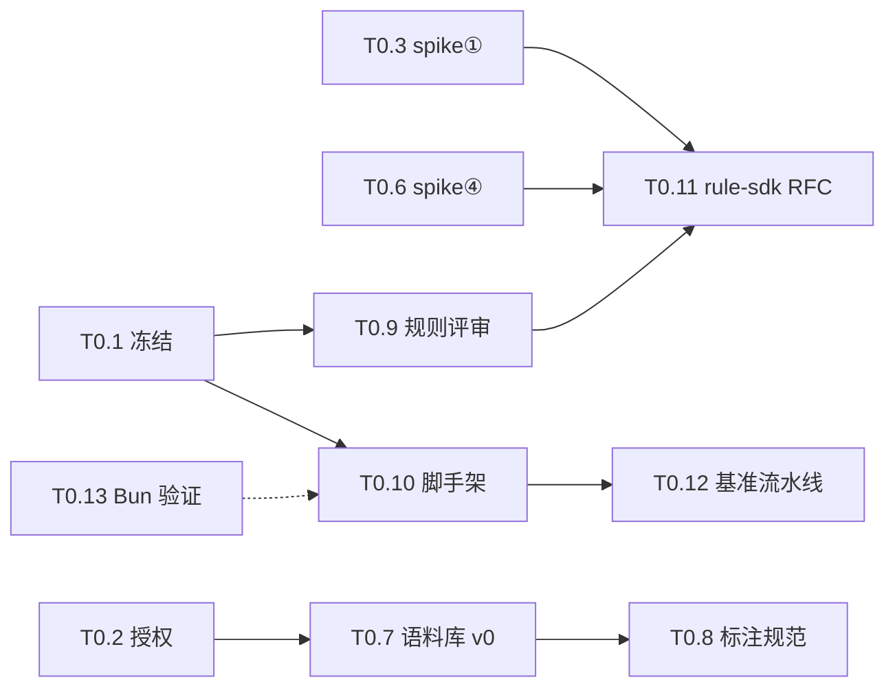

# lintsight · 任务清单 v0.1（分层滚动）

> 版本：v0.1 · 日期：2026-09-14 · 状态：生效中
> 上游：需求文档 v0.1 修订②（[requirements-v0.1.md](../requirements/requirements-v0.1.md)）、技术设计文档 v0.2 修订③（[requirements-v0.2.md](../requirements/requirements-v0.2.md)）。每个任务挂 FR/DR 编号，验收以需求文档为准。

## 维护约定（先读，防文档腐化）

1. **分层滚动**：M0 = 执行级（可认领、有 DoD）；M1 = 任务域（标 spike gate）；M2/M3 = 占位 + 依赖声明。**M0 出口评审时把 M1 拆到执行级并升版本 v0.2**——在此之前禁止预拆 M1 任务（铁律 6：spike 未出结论不启动正式实现）。
2. **状态翻转**：任务状态变更在 PR/commit 描述中引用任务编号（如 `T0.3`），DoD 全部满足才能标 done；完成证据（spike 报告/PR/评审记录）落 `docs/` 并在任务行附链接。
3. **远端迁移时机**：仓库推上 GitHub、建 Issue 体系后，M1 起的任务迁 Issues，本文档降级为里程碑级 roadmap（保留 gate 与依赖图）。
4. **新增任务**：必须挂 FR 编号或标注"评审新增"，不挂编号的活不进清单（AGENTS.md §5）。

**图例**：`[ ]` todo ｜ `[~]` doing ｜ `[x]` done ｜ ⛔ = 被 spike/评审结论阻塞 ｜ ◆ = 无前置依赖可立即并行

---

## M0 准备期（~1 月，执行级）

**出口标准**（全部满足才进 M1）：四项 spike 均有数据结论落档；语料库 v0 + 标注规范 v0 可用；差异化规则 25~30 条 + 内置启用映射清单定稿；脚手架 + CI 门禁就绪；rule-sdk RFC 评审通过。

### 任务

- [ ] **T0.1 设计与需求冻结签字** ◆
  挂载：§0 决策变量、铁律 7 条、§1.3 非目标。**DoD**：DR-1~6 与非目标清单逐项签字确认；未决开放问题（附录 B）指定 owner 与关闭时限。
- [ ] **T0.2 语料库授权与脱敏确认** ◆（FR-702 前置，**日历第一优先**）
  **DoD**：公司 monorepo 授权书面确认 + 脱敏方案定稿；备选开源大仓（vue / element-plus 级）确定并记录。
- [ ] **T0.3 spike ①：oxc crate PoC** ◆（FR-301/302 前置）
  **DoD**：parser/semantic/cfg 直连 demo；10 万行语料解析+语义构建耗时与内存数据；AstKind 覆盖度抽查报告；结论落 `docs/spikes/`（清单见 oxc-toolchain skill）。→ 定 M2 深度引擎路线
- [ ] **T0.4 spike ②：Vue SFC × oxlint JS Plugins 集成 PoC** ◆（FR-103 前置）
  **DoD**：虚拟块注入、诊断位置回映射、safe fix 逆映射三件事各一个可运行 demo；就地临时文件并发约定验证；vize bridge 评估结论；`createOnce` 与 onFileStart/onFileEnd 钩子对应关系实测。→ 定 M1 Vue 路线
- [ ] **T0.5 spike ③：tsgolint 实测** ◆（FR-305 前置）
  **DoD**：存量 tsconfig（baseUrl/paths/TS5）兼容性矩阵；类型事实传输格式/延迟/缓存数据；`oxlint --type-aware` 在 ≥1 个存量项目跑通；降级策略定稿。→ 定类型感知策略
- [ ] **T0.6 spike ④：oxlint JSON 诊断字段完备性实测** ◆（FR-401 前置）
  **DoD**：`-f json` 字段清单落档（span 精度、上下文字段有无、fix 结构）；M1 指纹锚点方案确认（messageId 口径，语义锚点可用性结论）。
- [ ] **T0.7 语料库 v0 + 基线脚本**（FR-702）｜依赖：T0.2
  **DoD**：3+1 仓库入库（含脱敏后 monorepo）、基线全量扫描跑通、diff 报告脚本可用、基线快照入库。
- [ ] **T0.8 标注规范 v0**（FR-702）｜依赖：T0.2 定仓库后可并行编写
  **DoD**：抽样方法、双人交叉标注流程、仲裁规则、简易标注表模板落档；在 1 个仓库试标注 50 条并复盘流程。
- [ ] **T0.9 P0 规则清单评审**（FR-202/203）｜依赖：T0.1；建议参考 T0.4/T0.6 结论
  **DoD**：差异化 25~30 条逐条过（检测逻辑/confidence 依据/误报场景/CWE 映射核定）；内置启用映射清单扩全（附录 A.5 → 完整版）；`no-v-html` 等待核条目定去留（对照 oxlint vue 内置）。
- [ ] **T0.10 monorepo 脚手架**（FR-704）◆｜依赖：T0.1
  **DoD**：Bun workspace（bun install + bun.lock 提交）+ changesets + CI 门禁（bun test/lint，工具链自吃狗粮：oxlint/oxfmt）；`rust/deep-engine` crate workspace 空壳；新规则包脚手架一条命令生成。
- [ ] **T0.11 rule-sdk 接口 RFC**（FR-205/206 的 M1 子集）｜依赖：T0.6（诊断字段影响 SourceCode 面）、T0.9（清单影响 API 需求）
  **DoD**：RuleMeta/RuleContext/生命周期（M1 生效子集：create/onFileStart/visitor/onFileEnd）+ RuleTester API 文档评审通过；RFC 落 `docs/`。
- [ ] **T0.12 CI 性能基准流水线骨架**（FR-703）｜依赖：T0.10
  **DoD**：hyperfine 基线脚本 + 回退 >15% 拦截 CI job（M0 期可先空跑校准）。
- [ ] **T0.13 Bun 运行时与分发验证**（DR-7；FR-501/503、NFR-1 前置）◆
  **DoD**：oxlint bin launcher 在 Bun 下 spawn 正常；`bun build --compile` 出 CLI demo 并验证平台二进制（oxlint/tsgolint）路径解析（darwin + linux 各一）；@vue/compiler-sfc 在 Bun 下兼容；Bun workspace + changesets 兼容；`bun test` 跑通 RuleTester 形态 demo；结论落 `docs/spikes/`。→ 兑现 DR-7「绑死 Bun + 单文件分发」的前提验证

### 依赖与分工视图（4~6 人参考）

| 角色 | 认领 | 说明 |
| --- | --- | --- |
| 编译器工程师 | T0.3、T0.11 | spike ① 是 M2 深度引擎关键路径 |
| Rust/Bun 工程师 | T0.6、T0.10、T0.12、T0.13 | 脚手架 + 运行时验证先行，喂全组 |
| 平台工程师（Bun） | T0.4、T0.5、T0.7 | 两条集成 spike 并行 |
| QA/语料库负责人 | T0.2、T0.7、T0.8、T0.9（标注侧） | 授权是第一优先 |

---

## M1 MVP（~3 月，任务域级，⛔ = spike gate）

> 出口标准：内部 ≥3 项目试用；万行库 <10s；竖切走通（§11.3：1 条规则从 CLI → Vue SFC → JSON 诊断含指纹 → exit code）。**M0 出口评审后本节细化到执行级并升版 v0.2。**

| 域 | 内容 | 挂载 | Gate |
| --- | --- | --- | --- |
| D1 cli + config-bridge 骨架 | lintsight.config 解析/校验 → .oxlintrc 翻译、进程编排、exit code | FR-101/105/403/501 | 无（T0.10 后即可启动） |
| D2 VueProcessor | SFC 拆块、虚拟文件注入、位置回映射、fix 逆映射 | FR-103/206 | ⛔ spike ② |
| D3 rule-sdk + RuleTester | M1 生效子集接口落地、用例框架（bun test 适配） | FR-203/701 | ⛔ T0.11 RFC |
| D4 差异化规则 25~30 条 | 分批：correctness（~10）→ security（~14）→ architecture（2） | FR-202 | ⛔ T0.9 清单定稿 |
| D5 diagnostic-bridge + 报告 | 统一诊断模型、指纹（messageId 口径）、JSON 输出、内置启用映射清单 | FR-201/401/402(JSON) | ⛔ spike ④ |
| D6 语料库运转 + 基准全量 | 基线维护流程、标注试点、基准门禁实跑 | FR-702/703 | 依赖 T0.7/T0.8 |
| D7 竖切走通 | §11.3 全链路验收，作为 D1~D5 的集成里程碑 | §11.3 | 依赖 D1~D5 |

---

## M2 可用（~4 月，占位 + 依赖声明，M1 出口后细化）

- 深度分析引擎（CFG/def-use/DFG/taint，FR-301/302）——gate：spike ① 结论
- 架构规则 + tsconfig 全对齐（含 baseUrl 兜底）**先行** → taint 竖切 3 条硬门槛（FR-303/304）→ 其余 stretch
- 双报消解层：注册表 + 接管对（FR-407）
- type-aware 直用启用（FR-305）——gate：spike ③ 降级策略
- SARIF/平台契约/抑制/新增问题模式（FR-402/404/405/406）——外部依赖：平台复核 SLA、契约联调窗口
- 迁移工具 / CI 模板 / 长驻 worker（FR-502/503/601，P1 顺延项；worker 部署运行时 = Bun，服务器标准化安装）

## M3 企业级（持续，仅占位）

- LSP/VS Code（FR-602/603）、调用图跨文件 taint、fixer 全量、远端缓存、AI 研判闭环、Vue template 深化
- 细化时机：M2 出口评审

---

*变更记录：v0.1（2026-09-14）——分层滚动方案成文：M0 执行级 12 任务、M1 七个任务域（标 gate）、M2/M3 占位。*
*v0.1 补充（2026-09-14，随需求修订③/设计修订④）：新增 T0.13 Bun 运行时与分发验证（DR-7）；T0.10 脚手架改 Bun workspace；角色名与 M1 D3/M2 占位同步 Bun 口径。*
